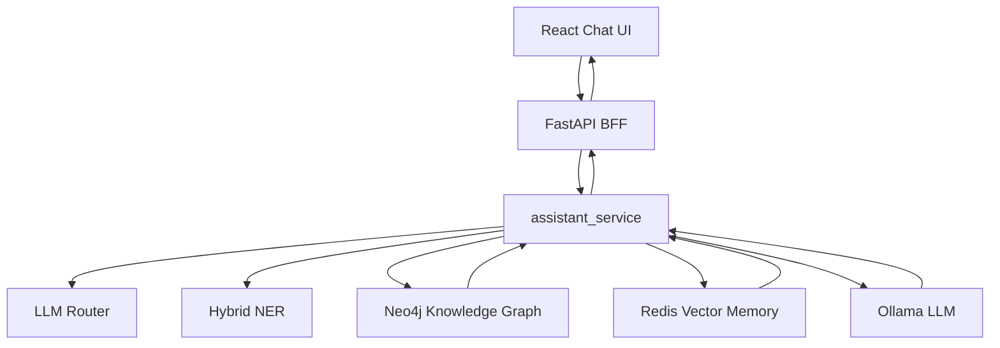

# MedSafetyAssistant

家庭用药安全助手（RAG + Knowledge Graph）。
核心目标：在医疗问答中降低纯 LLM 幻觉，优先给出可追溯的结构化依据。

## 快速启动

```bash
pip install -r requirements.txt

docker-compose up -d redis
neo4j console

ollama pull mxbai-embed-large:latest
ollama pull deepseek-r1:7b
# ollama pull qwen2.5-coder:14b  # 推荐模型（效果更好，机器配置允许时使用）

# 如需切换到推荐模型：
# export OLLAMA_MODEL=qwen2.5-coder:14b   # macOS/Linux
# set OLLAMA_MODEL=qwen2.5-coder:14b      # Windows PowerShell

python -m streamlit run app.py
```

## Full-Stack Mode

原始 `app.py` Streamlit 应用仍然保留，作为原型 UI 使用。Full-Stack Mode 在同一套后端编排服务之上增加 `FastAPI` BFF 和 `React Chat UI`，用于展示更清晰的 API 合约、流式回答和结构化证据。

### Backend

```bash
pip install -r requirements.txt
uvicorn api:app --reload --port 8000
```

API endpoints:

- `POST /api/query` - 非流式用药安全查询。
- `POST /api/query/stream` - SSE 风格流式查询，先返回元数据，再返回回答 token。
- `GET /api/health` - Neo4j、Redis、Ollama 的非阻塞配置诊断。
- `POST /api/v1/safety/check` - 只读取来源对齐事实的确定性 V1 风险检查。

### Source-Aligned Safety Engine (V1 Alpha)

新的 V1 Safety Engine 与旧 Cypher 图谱隔离，只读取 `data/v1/` 中通过 schema 和来源引用校验的记录。当前 alpha.1 只覆盖：

- 泰诺与感康共享对乙酰氨基酚的重复成分场景；
- 布洛芬与用于心血管保护的低剂量阿司匹林之间的条件性相互作用。

它会返回 `risk_found`、`no_known_risk_in_scope`、`insufficient_information`、`out_of_scope` 或 `knowledge_unavailable`，并返回 `fact_id`、`source_id`、来源定位、数据版本和限制。

```bash
curl -X POST http://localhost:8000/api/v1/safety/check \
  -H 'Content-Type: application/json' \
  -d '{"medications":["泰诺","感康"],"contexts":[]}'

/opt/homebrew/Caskroom/miniconda/base/envs/medsafety/bin/python scripts/validate_v1_data.py

/opt/homebrew/Caskroom/miniconda/base/envs/medsafety/bin/python scripts/evaluate.py \
  --dataset eval/safety_engine_dev.jsonl \
  --runner safety_engine \
  --data-dir data/v1 \
  --format markdown
```

当前数据是 `source_aligned`，不是 `clinically_reviewed`。7 条开发样例只用于确定性回归，不能作为临床准确率或锁定测试集结果。

### Frontend

```bash
cd frontend
npm install
npm run dev
```

打开 `http://localhost:5173`。

### Demo Questions

- `泰诺和感康能一起吃吗？`
- `我喝酒了，还能吃头孢吗？`
- `布洛芬和阿司匹林能一起吃吗？`
- `那我之前问过的药还能继续吃吗？`

## Interview Narrative

This project is best described as a lightweight Agentic AI full-stack system for a high-risk medication-safety scenario.

It is not a general-purpose Agent platform. The current agent layer is intentionally small and explainable: route selection over fixed backend tools, knowledge-graph retrieval, Redis memory retrieval, and evidence display in the UI.

The Route B items, such as tool registry, prompt management, trace events, memory abstraction, and regression evaluation sets, are future work after the Phase A full-stack base is stable.

## 系统架构图



## 与标准 RAG 的区别

标准 RAG：文档切块 -> Embedding -> 向量检索 -> Prompt 注入 -> LLM 生成。

本项目的差异：
- 用 `Neo4j` 结构化知识图谱承担核心事实检索（精确关系查询），而不是仅依赖语义相似检索。
- 增加“双路 NER（规则 + LLM）”作为前置路由，先抽实体再做图谱推理，减少盲检索噪声。
- `Redis` 向量检索主要用于历史对话上下文增强，不替代药品禁忌事实查询。

## LangChain 对照 Demo

仓库提供了一个最小可运行的标准 RAG 对照样例：

- 脚本: `examples/langchain_rag_demo.py`
- 语料: `examples/demo_med_faq.txt`
- 流程: `TextLoader -> OllamaEmbeddings -> FAISS -> RetrievalQA`

运行：

```bash
python examples/langchain_rag_demo.py
```

用途：
- 可说明“我既能用框架快速原型，也能按业务场景做自研控制层”。

## 增强项

- 轻量 `Rerank`：历史检索先按余弦相似度召回候选，再用 LLM 对候选重排，提升上下文相关性。
- 最小 `Agent` 路由：由 LLM 决定本轮优先走 `query_kg`（知识图谱）、`search_history`（历史检索）或 `both`（混合）。
- 稳定性策略：路由或 rerank 失败时自动回退到默认策略，不影响主流程可用性。

## 已知局限（面向工程事实）

- 当前 `Agent` 是“最小路由层”，本质是单次分类 + 固定函数调用，不是完整 ReAct 循环（缺少 observation 回传后的迭代决策）。
- 当前 `Rerank` 主要是定性验证效果，尚未完成系统化离线评测；已通过失败回退策略保障主流程稳定。

## Redis 管理命令

```bash
docker ps --filter "name=redisearch-new"
docker exec -it redisearch-new redis-cli ping
python test_redis_connection.py

docker logs -f redisearch-new
docker stop redisearch-new
docker start redisearch-new
docker restart redisearch-new
```
