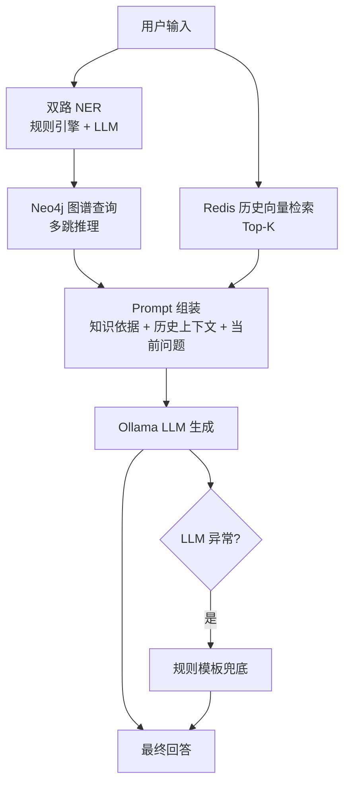

# MedSafetyAssistant

家庭用药安全助手（RAG + Knowledge Graph）。
核心目标：在医疗问答中降低纯 LLM 幻觉，优先给出可追溯的结构化依据。

## 快速启动

```bash
pip install -r requirements.txt

docker-compose up -d redis
neo4j console

ollama pull mxbai-embed-large:latest
ollama pull deepseek-r1:7b
# ollama pull qwen2.5-coder:14b  # 推荐模型（效果更好，机器配置允许时使用）

# 如需切换到推荐模型：
# export OLLAMA_MODEL=qwen2.5-coder:14b   # macOS/Linux
# set OLLAMA_MODEL=qwen2.5-coder:14b      # Windows PowerShell

python -m streamlit run app.py
```

## 系统架构图



## 与标准 RAG 的区别

标准 RAG：文档切块 -> Embedding -> 向量检索 -> Prompt 注入 -> LLM 生成。

本项目的差异：
- 用 `Neo4j` 结构化知识图谱承担核心事实检索（精确关系查询），而不是仅依赖语义相似检索。
- 增加“双路 NER（规则 + LLM）”作为前置路由，先抽实体再做图谱推理，减少盲检索噪声。
- `Redis` 向量检索主要用于历史对话上下文增强，不替代药品禁忌事实查询。

## LangChain 对照 Demo（面试用）

仓库提供了一个最小可运行的标准 RAG 对照样例：

- 脚本: `examples/langchain_rag_demo.py`
- 语料: `examples/demo_med_faq.txt`
- 流程: `TextLoader -> OllamaEmbeddings -> FAISS -> RetrievalQA`

运行：

```bash
python examples/langchain_rag_demo.py
```

用途：
- 面试中可说明“我既能用框架快速原型，也能按业务场景做自研控制层”。

## P1 增强项（已实现）

- 轻量 `Rerank`：历史检索先按余弦相似度召回候选，再用 LLM 对候选重排，提升上下文相关性。
- 最小 `Agent` 路由：由 LLM 决定本轮优先走 `query_kg`（知识图谱）、`search_history`（历史检索）或 `both`（混合）。
- 稳定性策略：路由或 rerank 失败时自动回退到默认策略，不影响主流程可用性。

## Redis 管理命令

```bash
docker ps --filter "name=redisearch-new"
docker exec -it redisearch-new redis-cli ping
python test_redis_connection.py

docker logs -f redisearch-new
docker stop redisearch-new
docker start redisearch-new
docker restart redisearch-new
```
