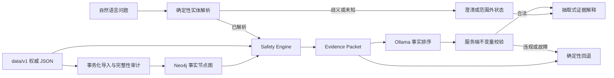

# MedSafetyAssistant

[](https://github.com/GFLabandon/MedSafetyAssistant/actions/workflows/quality.yml)

一个面向家庭常见用药场景的、**证据可追溯且可评测的 AI 应用后端**。

项目不让 LLM 自由创造医学结论：确定性 Safety Engine 从版本化事实目录生成
`EvidencePacket`，LLM 只能为已有事实排序，服务端随后校验结论、事实 ID、引用完整性和
严重度顺序；任何违规或模型故障都会触发确定性回退。

> **安全边界：**这是工程验证项目，不是医疗器械或临床决策系统。当前 V1 只有 3 条
> `source_aligned` 风险事实，没有医生或药师临床审核签名。

## 为什么这个项目不只是一次 LLM API 调用

- **确定性领域逻辑：**重复成分、条件性相互作用和严格限定禁忌由 Safety Engine 判断，
  不由模型决定。
- **可追溯证据：**每条正式结论都携带 `fact_id`、`source_id`、来源定位、数据版本和限制。
- **模型输出不可信：**未知、遗漏、重复事实 ID，结论篡改和严重度错序都会被服务端拒绝。
- **可重建图投影：**版本化 JSON 是权威源，Neo4j 是带唯一约束和幂等导入的查询投影。
- **失败也是评测结果：**仓库保留真实 Ollama 的 ID 复制与排序失败，而不是只展示成功样例。

## 当前可验证结果

| 证据 | 当前结果 | 解释边界 |
|---|---:|---|
| Python 回归 | `141 passed, 3 skipped` | 跳过项是需显式启动 Neo4j 的集成测试 |
| 实体规则开发集 | micro F1 `0.918`，18 条 | 开发集，不是医学准确率 |
| Safety Engine 开发集 | 13/13 whole-case match | 仅覆盖 3 条来源对齐事实；开发集共同迭代 |
| 脚本化输出护栏 v2 | 10/10，unsupported claim rate `0` | 对抗 fixture，不是真实模型质量 |
| Ollama v2 开发探针 | 15/15 合法计划 | 同一开发探针上的 schema 调优结果 |
| 锁定 opaque-ID 测试 | valid plan `0.833`，severity order `0.667` | 36 次真实请求；违规均被服务端拦截 |
| Neo4j 事实图 | 六条只读查询均命中索引，事实可沿边溯源 | 3 项隔离 Neo4j 5.26.28 集成验收 |

报告和原始失败证据：

- [项目状态与验收记录](docs/PROJECT_STATUS.md)
- [V1 alpha.2 数据卡](docs/DATA_CARD_V1_ALPHA_2.md)
- [Safety Engine alpha.3 基线](reports/baseline-safety-engine-v1-alpha.3.md)
- [输出护栏 v2 基线](reports/baseline-explanation-guardrails-v2.md)
- [真实 Ollama 开发基线](reports/baseline-ollama-evidence-order-v2.md)
- [锁定 opaque-ID 失败报告](reports/baseline-ollama-opaque-id-test-v1.md)
- [P1 产品链路验收](reports/p1-product-flow-acceptance.md)
- [P2 事实节点图验收](reports/p2-graph-model-acceptance.md)
- [P2 查询计划与事实溯源验收](reports/p2-query-and-provenance-acceptance.md)

## 核心架构



LLM 可以排列证据，但不能：

- 新增或改写医学事实；
- 改变 Safety Engine 的结论；
- 遗漏、重复或创造 `fact_id`；
- 生成来源、来源定位或严重度说明。

## V1 支持范围

当前 `v1.0.0-alpha.3` 的风险事实只覆盖：

1. 泰诺与感康共享对乙酰氨基酚的重复成分风险；
2. 布洛芬与用于心血管保护的阿司匹林之间的条件性相互作用；
3. 明确报告阿司匹林或其他 NSAID 相关哮喘、荨麻疹或过敏样反应史时的布洛芬禁忌。

实体层额外支持来源对齐的 `paracetamol`、`acetaminophen`，两者都解析为
“对乙酰氨基酚”。“扑热息痛”尚未通过本批来源门，仍返回范围外。alpha.3 没有增加风险
事实，完整边界见 [alpha.3 数据卡](docs/DATA_CARD_V1_ALPHA_3.md)。

API 使用五种结论状态：

| 状态 | 含义 |
|---|---|
| `risk_found` | 当前数据版本命中来源对齐风险 |
| `no_known_risk_in_scope` | 范围内未命中；不代表组合安全 |
| `insufficient_information` | 缺少判断必需的上下文 |
| `out_of_scope` | 药品或上下文不在当前覆盖范围 |
| `knowledge_unavailable` | 知识服务不可用，禁止显示为“无风险” |

完整边界见 [安全边界文档](docs/SAFETY_BOUNDARY.md)。

## 五分钟离线验收

要求 Python 3.10。以下步骤不需要启动 Neo4j、Redis 或 Ollama：

```bash
python -m pip install -r requirements-dev.txt

# Linux
sha256sum --check data/v1/checksums.sha256
# macOS
shasum -a 256 -c data/v1/checksums.sha256

python scripts/validate_v1_data.py
python -m pytest -q -m "not integration"

cd frontend
npm ci
npm run build
```

上述命令也是 GitHub Actions 的基础质量门。真实 Neo4j 和 Ollama 验收属于显式运行的
集成/评测任务，不会在普通离线测试中伪装为端到端通过。

## 运行 V1 API

```bash
uvicorn api:app --reload --port 8000
```

交互文档：`http://127.0.0.1:8000/docs`

自然语言正式入口：

```bash
curl -X POST http://127.0.0.1:8000/api/v1/query \
  -H 'Content-Type: application/json' \
  -d '{"question":"泰诺和感康能一起吃吗？","use_llm_plan":false}'
```

响应同时返回版本化 `resolution`、`explanation` 与 `request-trace-v1`：实体解析只匹配 `data/v1/` 中的受控
别名和上下文规则；模糊药名、未知药名、缺失适用条件和指令式注入文本不会进入开放域
医学生成。

### 运行状态

- `GET /api/live`：仅表示 API 进程存活，不访问外部依赖；
- `GET /api/ready`：并发、限时探测 V1 catalog、Redis、Neo4j 和 Ollama；
- `GET /api/health`：为兼容旧客户端保留，等价于 `/api/ready`。

V1 catalog 是正式确定性链路的必需依赖；Redis、Neo4j 和 Ollama 是可选能力。可选依赖
离线时状态为 `degraded`，不会伪装成全依赖就绪，也不会阻止 Safety Engine 使用本地
catalog 返回可验证结果。Ollama 生成失败时仍走确定性解释回退。

### 演示 1：重复成分风险

```bash
curl -X POST http://127.0.0.1:8000/api/v1/safety/explain \
  -H 'Content-Type: application/json' \
  -d '{"medications":["泰诺","感康"],"contexts":[],"use_llm_plan":false}'
```

预期：`risk_found`，并返回
`fact-duplicate-acetaminophen-001` 及其来源定位。

### 演示 2：缺少条件时拒绝过度判断

```bash
curl -X POST http://127.0.0.1:8000/api/v1/safety/check \
  -H 'Content-Type: application/json' \
  -d '{"medications":["布洛芬","阿司匹林"],"contexts":[]}'
```

预期：`insufficient_information`，要求补充阿司匹林用途。

### 演示 3：未知药品不等于安全

```bash
curl -X POST http://127.0.0.1:8000/api/v1/safety/check \
  -H 'Content-Type: application/json' \
  -d '{"medications":["星云片"],"contexts":[]}'
```

预期：`out_of_scope`，而不是“未发现风险”。

## 使用真实 Ollama 解释规划

默认模型为 `deepseek-r1:1.5b`。模型只负责完整事实 ID 的排序：

```bash
ollama pull deepseek-r1:1.5b
ollama serve

curl -X POST http://127.0.0.1:8000/api/v1/safety/explain \
  -H 'Content-Type: application/json' \
  -d '{"medications":["泰诺","感康"],"contexts":[],"use_llm_plan":true}'
```

模型不可用、超时或输出不符合合约时，响应会标记
`generation_mode: deterministic_fallback`，但不会丢失结构化证据。

评测命令、模型 digest、固定参数和数据集校验和见
[解释生成文档](docs/EXPLANATION_GENERATION.md)。

## Neo4j 查询投影

`data/v1/` 是唯一权威源。Neo4j 只作为可删除、可重建的读取投影，不允许反向覆盖 JSON。

本地开发可以使用仓库提供的 Compose 依赖（会把 Neo4j 暴露到项目默认的
`localhost:7687`，Redis 暴露到 `localhost:6379`）：

```bash
export NEO4J_PASSWORD=medsafety-local
docker compose -f docker-compose.local.yml up -d --wait
```

也可以自行提供 `NEO4J_URI`、`NEO4J_USER`、`NEO4J_PASSWORD` 和可选的
`NEO4J_DATABASE`。连接密码只用于本地开发，不要提交真实凭据。依赖准备好后：

```bash
python scripts/import_v1_to_neo4j.py
```

导入器先校验 catalog，然后在单个写事务中清理并重建独立的 `Safety*` 命名空间；
如果导入失败，清理也会回滚，不会留下半套投影。重复导入不会残留已从 JSON
目录删除的旧事实。`SafetyFact` 通过 `SUBJECT`、`OBJECT`、`APPLIES_IN`、
`SUPPORTED_BY` 和 `BELONGS_TO` 连接成分、上下文、来源与数据快照；风险查询走真实
关系而不是扫描 `subject/object` 属性。图模型与不变量见
[P2 知识图谱规格](docs/KNOWLEDGE_GRAPH_P2.md)。

只读检查现有 Docker 投影：

```bash
python scripts/import_v1_to_neo4j.py --audit-only
```

记录六条注册只读查询的 PROFILE 与索引证据：

```bash
python scripts/profile_neo4j_queries.py \
  --mode PROFILE \
  --output reports/neo4j-query-plan-v1.json
```

读取一条事实的完整图谱来源链：

```bash
curl http://127.0.0.1:8000/api/v1/knowledge/facts/fact-duplicate-acetaminophen-001
```

该接口要求 API 配置可用的 Neo4j 投影；未配置或投影损坏返回 503，未知事实 ID 返回
404，不会静默退回 JSON catalog。

真实隔离集成测试：

```bash
MEDSAFETY_PYTHON=python bash scripts/test_neo4j_integration.sh
```

测试使用临时实例和数据目录，连续导入两次、比较 JSON/Neo4j Repository 的完整
`EvidencePacket`，并人为删除事实关系以确认审计可以发现损坏；结束后移除专用容器与网络。

## V1 证据前端

```bash
cd frontend
npm ci
npm run dev
```

React 页面调用自然语言 V1 入口，明确展示五种结论状态、实体解析状态、澄清问题、
`fact_id`、来源 ID、来源定位、数据版本、生成模式、回退原因、request ID 和三阶段
耗时。它不读取共享会话历史。

当前正式、可验证的入口包括：

- `POST /api/v1/query`
- `POST /api/v1/safety/check`
- `POST /api/v1/safety/explain`
- `GET /api/v1/knowledge/facts/{fact_id}`（要求 Neo4j）

旧 `/api/query` 与 `/api/query/stream` 仅为兼容早期原型保留；其默认请求会生成独立
session ID，不再落入全局共享命名空间，但不属于 V1 安全结论的演示入口。

可重复浏览器契约测试：

```bash
cd frontend
npx playwright install chromium
npm run test:e2e
```

四条用例覆盖风险证据、缺失上下文澄清、未知药品和知识不可用。测试使用受控 API
fixture 验证前端状态契约；真实后端与外部依赖由 Python 故障测试和 P1 实机 smoke
test 分别验证。

## 仓库结构

```text
medsafety/            V1 契约、Safety Engine、解释护栏和 Repository
data/v1/              版本化权威数据与校验和
evaluation/           可复现评测 runner
eval/                 开发集、对抗集和锁定 contract test
reports/              指标、失败分析和真实模型原始记录
scripts/              数据校验、评测和 Neo4j 导入入口
test/                 单元、契约、API 和隔离集成测试
frontend/             React V1 状态、澄清与证据界面
docs/                 安全边界、图模型、数据卡、评测协议和项目状态
```

## 已知限制

- 只有 3 条来源对齐事实，覆盖范围不能外推到真实世界总体用药安全。
- 当前医学开发样例与规则共同迭代，尚无按 `fact_id` 分组的独立医学测试集。
- 没有医生或药师临床审核签名，`source_aligned` 不等于 `clinically_reviewed`。
- 自然语言解析仅覆盖 `data/v1/` 中的受控别名和少量上下文规则，尚不支持跨轮指代消解。
- 正式 V1 查询当前无持久会话；旧接口会话具有默认 24 小时 TTL 和显式清除接口，但
  没有认证或用户账户绑定，不能作为生产会话系统。
- P1 已完成 Neo4j、Redis、Ollama 同时在线的 API smoke baseline；它是单机开发验收，
  不是负载、可用性或生产 SLO 证据。
- 当前不是 ReAct、多 Agent、MCP 平台或生产高并发系统。

下一阶段与验收门见 [项目状态](docs/PROJECT_STATUS.md) 和
[完整升级计划](docs/PROJECT_PLAN.md)。
