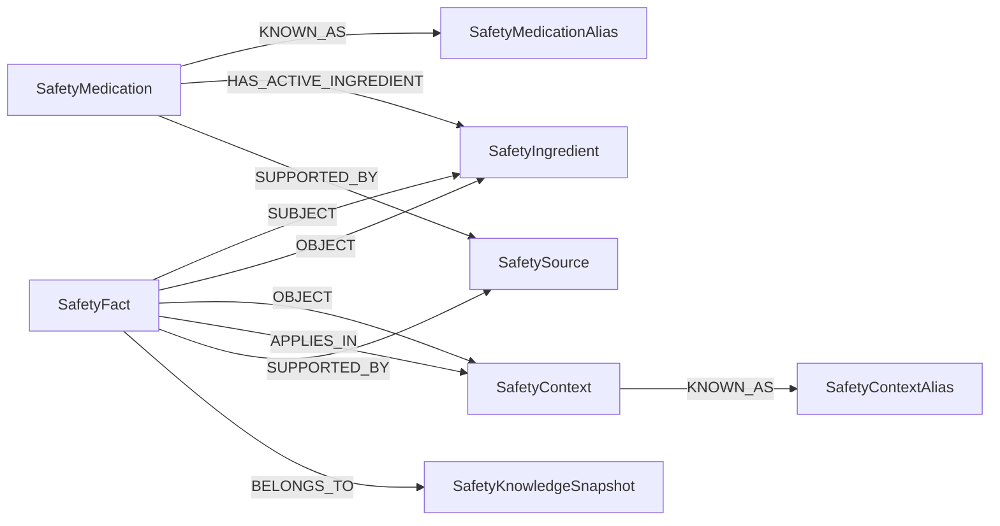

# P2 事实节点知识图谱规格

日期：2026-07-25
状态：第二批实现

## 1. 目标与边界

P2 把 Neo4j 从“保存事实属性的数据库投影”升级为“可以沿实体、事实、条件、来源和
快照关系遍历的知识图谱投影”。`data/v1/*.json` 仍是唯一权威源，Neo4j 可以被删除和
重建，绝不反向覆盖 JSON。

本批只迁移现有 3 条 `source_aligned` 事实。旧 Cypher 中缺少精确来源定位的关系继续
保持 `legacy_unreviewed`，不因进入 Neo4j 就自动升级为正式医学事实。

## 2. 图模型



事实类型与端点：

| predicate | SUBJECT | OBJECT | APPLIES_IN |
|---|---|---|---|
| `DUPLICATE_INGREDIENT` | Ingredient | Ingredient | 可选 |
| `INTERACTS_WITH` | Ingredient | Ingredient | 来自 `required_context` |
| `CONTRAINDICATED_IN` | Ingredient | Context | 来自 `required_context` |

`SafetyFact.subject` 与 `SafetyFact.object` 属性暂时保留，用于重建严格 Pydantic 契约和
检查属性—关系是否一致；Repository 的风险检索必须走 `SUBJECT`/`OBJECT` 边。

## 3. 导入不变量

导入器只删除带 `Safety*` 标签的专用投影，并在同一个写事务中完成重建和完整性检查。
提交前必须同时满足：

- 节点数与权威 catalog 一致；
- 每条正式事实恰有一个 `SUBJECT`、一个 `OBJECT` 和一个 `BELONGS_TO`；
- `SUPPORTED_BY`、`APPLIES_IN` 和药品—成分关系数量与 JSON 引用一致；
- 事实不存在悬空的主体、客体、来源或快照；
- 药品、上下文、事实的数据版本与快照一致；
- `subject/object` 属性与对应边的端点名称一致。

任何一项失败都会抛出 `ProjectionIntegrityError`，令整个重建事务回滚。已有投影可以
通过以下命令只读复核：

```bash
python scripts/import_v1_to_neo4j.py --audit-only
```

## 4. 查询不变量

- 重复成分、相互作用和禁忌查询均从 `SafetyFact` 沿真实关系匹配端点；
- 查询只接受 `reviewed` 且 `source_aligned`/`clinically_reviewed` 的事实；
- 事实必须属于命名快照，且 `fact.data_version == snapshot.data_version`；
- Neo4j 驱动错误、无快照、损坏记录或版本漂移继续映射为
  `knowledge_unavailable`，不得降级为“未发现风险”。

## 5. 第一批验收门

- 离线单元测试验证参数化写入、边遍历查询和完整性失败；
- Docker Neo4j 连续导入两次后节点与关系计数完全一致；
- JSON 与 Neo4j Repository 的七类 `EvidencePacket` 完全等价；
- 人为删除一条 `SUBJECT` 边后，只读审计必须报告孤立事实；
- 公开仓库审计和原有后端、前端、浏览器质量门保持通过。

## 6. 第二批：索引查询与事实溯源

- 药品和上下文的规范名、别名分别投影为 `SafetyMedicationAlias` 和
  `SafetyContextAlias`，`normalized_name` 唯一约束负责快速、无歧义解析；
- 导入完整性检查同时验证别名节点、`KNOWN_AS` 边、数据版本和 JSON 属性集合；
- `GET /api/v1/knowledge/facts/{fact_id}` 沿 `SUBJECT`、`OBJECT`、`APPLIES_IN`、
  `SUPPORTED_BY` 和 `BELONGS_TO` 返回严格事实溯源契约；第二批对应
  `fact-provenance-v1`；
- 接口只读取 Neo4j，不用 JSON 静默掩盖投影故障；未配置/损坏返回 503，未知事实返回
  404；
- `scripts/profile_neo4j_queries.py` 只注册六条只读查询，保存查询类型、算子、索引、
  DB hits 和通知；PROFILE 结果不得包装为负载或可扩展性基准。

机器可读证据见
[`neo4j-query-plan-v1.json`](../reports/neo4j-query-plan-v1.json)，阶段报告见
[`p2-query-and-provenance-acceptance.md`](../reports/p2-query-and-provenance-acceptance.md)。

## 7. 第三批：产品主体与活动限制

第三批在不修改 alpha.3 正式数据的前提下扩展事实端点：

- `FactRecord` 显式区分 `subject_kind` 与 `object_kind`，旧事实按 predicate 确定性补齐；
- `ACTIVITY_RESTRICTION` 只允许 `Medication(product) → Context(activity)`；
- Neo4j 的 `SUBJECT` 同时允许 `SafetyIngredient` 和 `SafetyMedication`，完整性审计会
  验证端点标签、事实类型属性与名称一致；
- Safety Engine 只在活动上下文被显式解析时，按稳定 `medication_id` 查询产品限制；
- 事实溯源升级为 `fact-provenance-v2`，Medication 主体返回稳定 medication ID；
- 查询计划注册表增加产品活动限制查询。

完整迁移与停止条件见
[`P2_PRODUCT_FACT_MODEL.md`](P2_PRODUCT_FACT_MODEL.md)。本批的产品限制只存在于测试
夹具；正式泰诺事实必须通过后续独立数据版本进入。

## 8. 后续内容扩充门

后续批次扩充药品和事实时，目标不是追求节点数量，而是增加有明确 URL、版本、章节定位、
访问日期和审核记录的场景。没有精确来源定位的医学主张不得进入正式 V1；达到小型、
可评测覆盖后先冻结评测集，不无边界堆数据。

当前第二批只建立了
[`P2_SOURCE_CANDIDATES.md`](P2_SOURCE_CANDIDATES.md)，没有修改正式事实。候选完成准入
审核后，应在新的数据版本和独立医学内容 PR 中扩充，不能直接把 legacy 关系导入。
