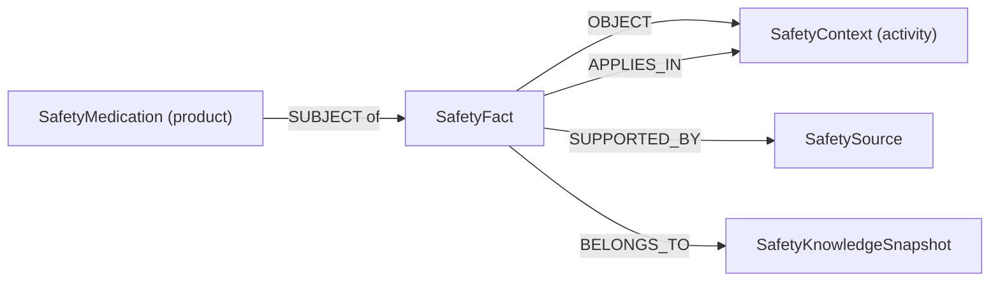

# P2 产品级事实模型规格

日期：2026-07-25
状态：工程模型已验收；正式数据由后续独立版本管理

## 1. 为什么需要单独建模

alpha.3 来源审计确认，泰诺官方说明书可以支持“服药期间不得驾驶或操作机械”这一产品级
活动限制，但不能支持把它改写为“氯苯那敏成分禁忌”。当前模型把每条事实的主体固定为
Ingredient，因此无法无损表达该来源。

本批只扩展事实契约、图投影、Repository、Safety Engine 和溯源 API。`data/v1/` 继续
冻结在 `v1.0.0-alpha.3`，泰诺活动限制不会在本工程批中进入正式事实。

## 2. 允许的事实形状

| predicate | subject_kind | object_kind | risk_type |
|---|---|---|---|
| `DUPLICATE_INGREDIENT` | `ingredient` | `ingredient` | `DUPLICATE_THERAPY` |
| `INTERACTS_WITH` | `ingredient` | `ingredient` | `INTERACTION` |
| `CONTRAINDICATED_IN` | `ingredient` | `context` | `CONTRAINDICATION` |
| `ACTIVITY_RESTRICTION` | `medication` | `context` | `ACTIVITY_RESTRICTION` |

约束：

- `medication` 主体必须指向 `kind=product` 的正式药品记录，不能用成分记录代替产品；
- context 客体必须同时出现在 `required_context`；
- 新类型只在用户明确给出并成功解析活动上下文时命中；
- Repository 使用稳定 `medication_id` 查询产品主体，不用商品名字符串直接拼 Cypher；
- LLM 不负责创建端点、选择事实或把产品限制外推到其他同成分产品。

## 3. 兼容迁移

`FactRecord` 新增 `subject_kind`、`object_kind`。为保持 alpha.3 冻结文件不变，旧事实在
加载时按 predicate 确定性补齐：

- 旧主体默认为 `ingredient`；
- `CONTRAINDICATED_IN` 客体推断为 `context`；
- 其他旧 predicate 客体推断为 `ingredient`。

导入 Neo4j 时会把补齐后的类型写入 `SafetyFact` 属性，并验证属性类型与真实
`SUBJECT`/`OBJECT` 端点标签一致。旧投影应通过重建迁移，JSON 仍是唯一权威源。

## 4. 图与 API

`GET /api/v1/knowledge/facts/{fact_id}` 升级为 `fact-provenance-v2`，主体引用会明确返回：

- `kind=medication`
- `identifier=<stable medication_id>`
- `name=<canonical product name>`

已有 Ingredient 主体仍返回 `kind=ingredient`，其 identifier 与规范成分名相同。

## 5. 验收门

- 旧 alpha.3 数据无需修改即可通过全部回归；
- 合同拒绝 predicate、端点类型和 risk type 不一致的事实；
- catalog 拒绝不存在的产品主体、substance 主体和未登记 activity context；
- JSON 与 Neo4j 对产品级测试事实生成相同 `EvidencePacket`；
- 事实溯源能够还原 Medication 主体的稳定 ID；
- 人为把产品主体边改连到 Ingredient 后，完整性审计必须失败；
- 新增只读活动限制查询必须参数化、命中索引，且不修改图；
- 所有测试事实仅存在于测试夹具，不进入 `data/v1/`。

## 6. 后续独立数据批

工程模型验收后，下一数据批才可以：

1. 增加活动上下文及其保守别名；
2. 增加泰诺官方说明书 SourceRecord；
3. 增加一条泰诺产品主体的 `ACTIVITY_RESTRICTION`；
4. 提升数据版本、校验和、数据卡和开发评测集；
5. 明确不外推到感康或氯苯那敏成分。

工程验收与机器可读查询证据见
[`p2-product-fact-model-acceptance.md`](../reports/p2-product-fact-model-acceptance.md)。

后续状态：alpha.4 已在独立数据分支按本规格增加一条泰诺产品级活动限制，来源与防外推
边界见 [`DATA_CARD_V1_ALPHA_4.md`](DATA_CARD_V1_ALPHA_4.md)。本规格中的“测试夹具”
描述只针对工程模型 PR #5 的验收阶段。
