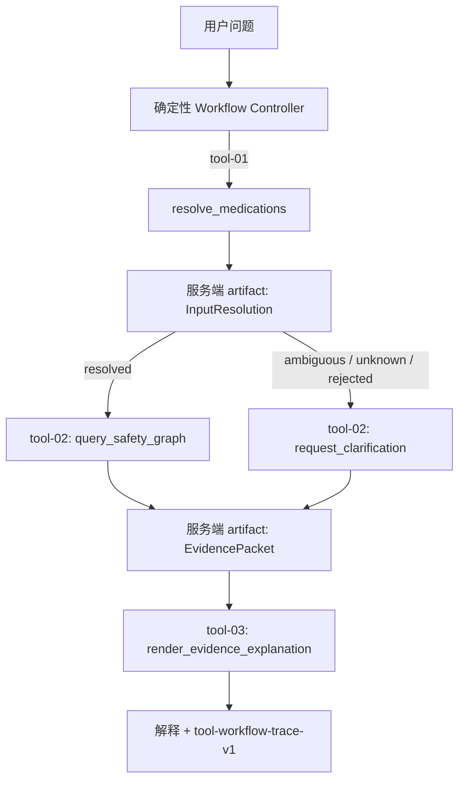

# P3 Typed Tool Workflow v1

日期：2026-07-25
实现基线：`68cb5d9d9caf1b7e7e893333b5e65519e9d4f1f5`
状态：确定性执行层、shadow planner 与服务端绑定的 name-only 路由已实现

## 1. 目标

P3 的第一步不是增加自由 ReAct 循环，而是先建立一个能被自动检查的工具执行边界：

- 工具名必须来自固定注册表；
- 每个工具的输入和输出都使用严格 Pydantic schema；
- 未知工具、额外参数、错误产物引用和非法输出不能进入后续阶段；
- 工具间不传递由调用方提供的 `EvidencePacket`，只传递服务端保存的 `call_id`；
- 每次请求最多执行 4 步，当前成功路径固定执行 3 步；
- trace 只记录参数键、schema、状态和耗时，不记录问题、药名或医学内容；
- LLM 仍然只能在现有 Evidence Packet 内排序事实，不能决定医学结论。

这使后续 Function Calling 可以在明确的信任边界内开发和评测，而不是让模型直接调用
数据库或构造医学事实。

## 2. 当前工具

| 工具 | 输入 | 输出 | 边界 |
|---|---|---|---|
| `resolve_medications` | 原始问题 | `InputResolution` | 只解析正式 catalog 实体 |
| `query_safety_graph` | 已完成解析的 `call_id` | `EvidencePacket` | 不接受药品列表或 Cypher |
| `request_clarification` | 未解析结果的 `call_id` | 非风险 `EvidencePacket` | 不能用于已解析输入 |
| `render_evidence_explanation` | Evidence Packet 的 `call_id` | `SafetyExplanation` | 不能由调用方提交事实包 |

工具 schema 可通过 `GET /api/v1/workflows/safety/tools` 读取。所有输入 schema 都包含
`additionalProperties: false`。

## 3. 执行流程



artifact 只存在于单次 `run()` 的局部内存中，不跨请求共享。工具只能用已执行调用的
`call_id` 获取特定类型产物；不存在、类型错误或状态不兼容的引用会在领域执行前被拒绝。

## 4. 失败语义

注册表使用有限、稳定且不包含内部异常文本的失败原因：

- `unknown_tool`
- `invalid_arguments`
- `invalid_artifact_reference`
- `invalid_output`
- `tool_execution_failed`
- workflow 控制器额外使用 `step_limit_exceeded`

API 在工作流无法完成时返回统一 `tool_workflow_failed`，不会返回 traceback、处理器异常或
artifact 内容。

## 5. API

列出工具：

```bash
curl http://127.0.0.1:8000/api/v1/workflows/safety/tools
```

执行 typed workflow：

```bash
curl -X POST http://127.0.0.1:8000/api/v1/workflows/safety/query \
  -H 'Content-Type: application/json' \
  -d '{"question":"泰诺和感康能一起吃吗？","use_llm_plan":false}'
```

该端点在线程池执行同步的 Repository/Ollama 路径，避免直接阻塞 FastAPI 事件循环。原
`POST /api/v1/query` 契约保持不变。

## 6. 首批验收

实现基线 `68cb5d9` 上：

- 完整离线回归：`160 passed, 5 skipped`；
- typed workflow 专项：12 项；
- 正常风险、活动限制、未知输入、提示注入和步数上限路径通过；
- 未知工具不会调用任何处理器；
- 含 `cypher` 或伪造 `tool_name` 的额外参数在处理器执行前被拒绝；
- 模型伪造的 artifact ID 无法触发 Safety Engine；
- handler 返回非法结构时不会进入下一个工具；
- OpenAPI 可生成两个新增端点；
- V1 数据校验和 5/5 通过，catalog 仍为 9 Source、5 Medication、3 Context、4 Fact；
- 公开仓库审计通过，共 153 个已跟踪文件。

机器可读证据见
[`p3-typed-tool-workflow-v1.json`](../reports/p3-typed-tool-workflow-v1.json)，验收摘要见
[`p3-typed-tool-workflow-acceptance.md`](../reports/p3-typed-tool-workflow-acceptance.md)。

## 7. 首批提交时明确未完成

- 当前 controller 是确定性的，LLM 尚不负责选择工具；
- 没有 ReAct 循环、多 Agent、MCP Server 或任意工具执行；
- 没有 Redis 历史工具，正式 V1 仍要求用户在追问中明确写出药品；
- 12 项专项测试是工程契约回归，不是独立模型评测或医学准确率；
- 还没有 50—80 条冻结的工具选择/路由评测集；
- 还没有真实 Ollama Function Calling 的 shadow-mode 基线。

这些是实现提交 `68cb5d9` 时的边界；其中冻结数据集和 shadow planner 已在下一批完成，
现状见第 8 节。只有在非法工具执行率保持 0、工具选择结果可复现且失败样例完成归因后，
才考虑让模型影响控制流。

## 8. Shadow tool planner（2026-08-02）

下一批已经完成“只观察、不执行”的 Function Calling 适配层：

- `eval/tool_shadow_v1.jsonl` 冻结 60 条样例，其中 40 条 dev、20 条 locked test；
- 数据集 SHA-256 为
  `e037caf4a9aa3e2db33c2fb1fbc3cca6ca854a1e47bd16cc5a008cf25f8a3229`；
- 覆盖 `start`、`after_resolution`、`after_evidence` 三个受信工作流状态；
- 覆盖未知工具、Cypher 注入、额外参数、多个工具、无工具、artifact 伪造和循环请求；
- 模型只能看到严格 `ShadowWorkflowState`，不能提交领域对象或改变服务端 artifact；
- proposal 必须再次通过已注册工具名和对应 Pydantic 参数 schema；
- runner 的输出逐条标记 `executed: false`，汇总固定包含 `executed_tool_calls: 0`；
- 代码路径不调用 `TypedToolRegistry.execute`，测试用 spy 验证执行次数为 0；
- locked test 必须显式确认，避免在开发阶段误跑并调优。
- runner 在发送样例前验证模型 `tools` capability，不兼容模型直接停止。

当前工具执行、冻结数据和 shadow planner 共 34 项契约通过；完整回归为
`182 passed, 5 skipped`。原有 `deepseek-r1:1.5b` 不支持 tools，真实 shadow 改用
`qwen3:1.7b`。在 40 条 dev 上，v3 tool-name accuracy 为 `1.000`、whole-call exact
match 为 `0.950`；首次 20 条 locked test 分别为 `0.950` 和 `0.850`。所有 60 次最终
基线 proposal 的执行数为 0。

locked test 保留 3 项失败：两项参数删除句末标点，一项问题注入诱导模型在 `start`
阶段错选 `query_safety_graph`。伪造的 artifact 引用会被服务端拒绝，但该失败仍证明模型
不能进入正式控制流。v3 不再针对锁定结果调优；后续如改为“模型只选工具名、服务端从
可信状态构造参数”，必须创建新的 prompt/数据集版本并重新走 shadow 门。

详见 [`p3-tool-shadow-contract-v1.md`](../reports/p3-tool-shadow-contract-v1.md)。在真实 dev
结果完成失败归因前，模型仍不得影响正式控制流；即使 shadow 指标通过，也需要单独设计
可回退的受控执行实验，不能直接升级为开放式 Agent。

## 9. Server-bound name-only 路由（2026-08-02）

锁定测试暴露“模型复制参数”和“问题文本诱导错选”后，新路径收窄了模型权限：

- planner 只看到 `stage` 和必要的 `resolution_status`，看不到问题、药品、artifact ID、
  Evidence Packet 或 Cypher；
- 发布给模型的四个工具都使用空参数 schema，模型输出的任何参数都不会被解析或保留；
- 服务端按阶段计算唯一允许的工具名，并从可信 `ShadowWorkflowState` 构造严格参数；
- 名称匹配才记为 `proposal_accepted`；未知工具、阶段错选、无调用或请求失败分别进入稳定
  回退分类；
- 无论模型是否成功，只有服务端构造的 `ToolCallRequest` 能进入原有 typed registry；
- `server-bound-tool-decision-trace-v1` 只记录名称、参数键、耗时与回退原因，不记录参数值；
- 新增 `/api/v1/workflows/safety/agent-query`，原确定性 `/query` 端点和契约保持不变。

这条路径允许验证真实 Function Calling 与完整工具执行链，但模型仍不能决定医学结论、
创建事实、提交 artifact、生成 Cypher 或开启无界循环。模型错选时执行仍回退到阶段确定的
调用，因此报告必须同时公开 raw tool-name accuracy 和 server-bound call accuracy，不能只
展示后者。

同一 40 条开发样例、温度 0、seed 42 的模型选择结果：

| 模型 | Raw name | Bound call | Fallback | P50 / P95 |
|---|---:|---:|---:|---:|
| `qwen3:1.7b` | `0.875` | `1.000` | `0.125` | `417 / 507ms` |
| `qwen3:4b` thinking | `0.000` | `1.000` | `1.000` | `1832 / 2009ms` |
| `qwen3:4b-instruct` | `1.000` | `1.000` | `0.000` | `749 / 856ms` |

普通 `qwen3:4b` 在当前 Ollama 标签下把输出预算用于 thinking 文本并以 `length` 结束，未
发出工具调用，因此没有因参数更大而被选中。`qwen3:4b-instruct` 还在 5 个解释开发探针
上重复 3 次：15 次请求 valid plan、结论保持、事实覆盖和来源追溯均为 `1.000`，
unsupported claim 与 fallback 均为 `0`；这些仍是开发集结果，不是独立模型泛化证明。

## 10. 单模型本地运行时（2026-08-02）

项目本地运行已收敛为一个 Ollama 模型：`qwen3:4b-instruct` 同时承担解释规划、服务端
绑定的工具名提议和可选会话 rerank。Redis 会话候选召回不再请求 `/api/embed`，而是使用
`local-char-ngram-hashing-v1` 生成 512 维确定性字符 n-gram hashing 向量。

该向量器的定位是小规模、同会话内的药名与相近措辞词法召回，不是学习得到的语义
embedding，也没有通用检索质量声明。Redis 每条记录保存 `vectorizer_id` 与维度；旧
provider、缺失 provenance 或维度不一致的记录不会参与比较，并按既有 TTL 自然过期。

本机已经删除 `deepseek-r1:1.5b`、`qwen3:1.7b` 和 thinking 版 `qwen3:4b`，历史模型报告
与原始记录仍保留在仓库中；只有在复现历史基线时才需要临时重新拉取。冷卸载后首次完整
Agent 查询的三个工具决策均被模型接受，事实 ID 和解释均通过服务端护栏。详细命令、延迟、
Redis 隔离结果和自动化质量门见
[`p3-single-model-runtime-acceptance.md`](../reports/p3-single-model-runtime-acceptance.md)。
