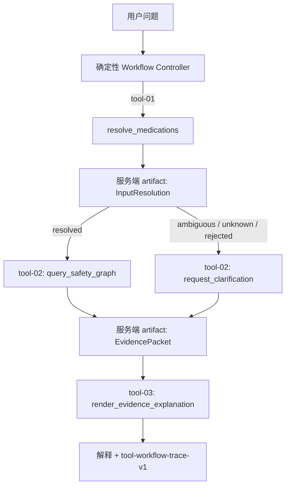

# P3 Typed Tool Workflow v1

日期：2026-07-25
实现基线：`68cb5d9d9caf1b7e7e893333b5e65519e9d4f1f5`
状态：首批已实现，模型工具选择尚未启用

## 1. 目标

P3 的第一步不是增加自由 ReAct 循环，而是先建立一个能被自动检查的工具执行边界：

- 工具名必须来自固定注册表；
- 每个工具的输入和输出都使用严格 Pydantic schema；
- 未知工具、额外参数、错误产物引用和非法输出不能进入后续阶段；
- 工具间不传递由调用方提供的 `EvidencePacket`，只传递服务端保存的 `call_id`；
- 每次请求最多执行 4 步，当前成功路径固定执行 3 步；
- trace 只记录参数键、schema、状态和耗时，不记录问题、药名或医学内容；
- LLM 仍然只能在现有 Evidence Packet 内排序事实，不能决定医学结论。

这使后续 Function Calling 可以在明确的信任边界内开发和评测，而不是让模型直接调用
数据库或构造医学事实。

## 2. 当前工具

| 工具 | 输入 | 输出 | 边界 |
|---|---|---|---|
| `resolve_medications` | 原始问题 | `InputResolution` | 只解析正式 catalog 实体 |
| `query_safety_graph` | 已完成解析的 `call_id` | `EvidencePacket` | 不接受药品列表或 Cypher |
| `request_clarification` | 未解析结果的 `call_id` | 非风险 `EvidencePacket` | 不能用于已解析输入 |
| `render_evidence_explanation` | Evidence Packet 的 `call_id` | `SafetyExplanation` | 不能由调用方提交事实包 |

工具 schema 可通过 `GET /api/v1/workflows/safety/tools` 读取。所有输入 schema 都包含
`additionalProperties: false`。

## 3. 执行流程



artifact 只存在于单次 `run()` 的局部内存中，不跨请求共享。工具只能用已执行调用的
`call_id` 获取特定类型产物；不存在、类型错误或状态不兼容的引用会在领域执行前被拒绝。

## 4. 失败语义

注册表使用有限、稳定且不包含内部异常文本的失败原因：

- `unknown_tool`
- `invalid_arguments`
- `invalid_artifact_reference`
- `invalid_output`
- `tool_execution_failed`
- workflow 控制器额外使用 `step_limit_exceeded`

API 在工作流无法完成时返回统一 `tool_workflow_failed`，不会返回 traceback、处理器异常或
artifact 内容。

## 5. API

列出工具：

```bash
curl http://127.0.0.1:8000/api/v1/workflows/safety/tools
```

执行 typed workflow：

```bash
curl -X POST http://127.0.0.1:8000/api/v1/workflows/safety/query \
  -H 'Content-Type: application/json' \
  -d '{"question":"泰诺和感康能一起吃吗？","use_llm_plan":false}'
```

该端点在线程池执行同步的 Repository/Ollama 路径，避免直接阻塞 FastAPI 事件循环。原
`POST /api/v1/query` 契约保持不变。

## 6. 首批验收

实现基线 `68cb5d9` 上：

- 完整离线回归：`160 passed, 5 skipped`；
- typed workflow 专项：12 项；
- 正常风险、活动限制、未知输入、提示注入和步数上限路径通过；
- 未知工具不会调用任何处理器；
- 含 `cypher` 或伪造 `tool_name` 的额外参数在处理器执行前被拒绝；
- 模型伪造的 artifact ID 无法触发 Safety Engine；
- handler 返回非法结构时不会进入下一个工具；
- OpenAPI 可生成两个新增端点；
- V1 数据校验和 5/5 通过，catalog 仍为 9 Source、5 Medication、3 Context、4 Fact；
- 公开仓库审计通过，共 153 个已跟踪文件。

机器可读证据见
[`p3-typed-tool-workflow-v1.json`](../reports/p3-typed-tool-workflow-v1.json)，验收摘要见
[`p3-typed-tool-workflow-acceptance.md`](../reports/p3-typed-tool-workflow-acceptance.md)。

## 7. 明确未完成

- 当前 controller 是确定性的，LLM 尚不负责选择工具；
- 没有 ReAct 循环、多 Agent、MCP Server 或任意工具执行；
- 没有 Redis 历史工具，正式 V1 仍要求用户在追问中明确写出药品；
- 12 项专项测试是工程契约回归，不是独立模型评测或医学准确率；
- 还没有 50—80 条冻结的工具选择/路由评测集；
- 还没有真实 Ollama Function Calling 的 shadow-mode 基线。

下一批先冻结工具选择评测集并实现只记录、不执行的 shadow planner。只有在非法工具执行率
保持 0、工具选择结果可复现且失败样例完成归因后，才考虑让模型影响控制流。
