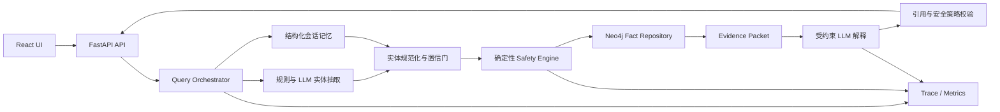

# MedSafetyAssistant 可验证 AI 应用升级计划

日期：2026-07-20
计划周期：6 周
项目定位：面向家庭常见用药场景的、证据可追溯的风险筛查与解释系统
求职定位：AI 应用后端 / Python AI 后端实习项目

> 2026-07-24 路线校准：原计划第 1—3 周的契约、Safety Engine、Neo4j Repository
> 与解释护栏已经完成。当前先执行公开可见性 P0（基础 CI、README 证据首屏和默认分支
> PR），再进入实体边界和 V1 前端统一。实际进度与最新验收结果以
> [`PROJECT_STATUS.md`](PROJECT_STATUS.md) 为准。

> 2026-07-25 P2 启动：P1 已合并默认分支。P2 第一批先完成事实节点中心图模型、
> 关系遍历、投影完整性审计和公开仓库持续门禁；医学内容扩充在模型验收后单独进行，
> 详见 [`KNOWLEDGE_GRAPH_P2.md`](KNOWLEDGE_GRAPH_P2.md)。

> 2026-07-25 P3 启动：P2 PR #3—#6 已按依赖顺序合并。P3 先建立固定 typed tool
> 注册表、严格 schema、服务端 artifact 引用和有限步数，再冻结工具选择评测集；在
> shadow 评测通过前，不允许模型控制真实工具执行。详见
> [`P3_TYPED_TOOL_WORKFLOW.md`](P3_TYPED_TOOL_WORKFLOW.md)。

## 1. 计划结论

本项目下一阶段不继续堆叠 Agent、MCP 或多模型框架，而是完成一条可以被独立检验的工程闭环：

> 可追溯事实数据 → 确定性风险计算 → 受证据约束的 LLM 解释 → 安全回退 → 固定评测集 → 集成测试与 CI → 可复现演示和评测报告。

最终作品不是“能回答所有用药问题的医生”，而是一个范围明确、知道何时拒答、每条风险结论都能展示依据的工程化 AI 应用。

项目完成后，简历应当能够用真实实验结果回答以下问题：

1. 系统覆盖什么范围，不能回答什么？
2. 图谱事实来自哪里，如何更新和审核？
3. 与纯 LLM 相比，系统在哪些指标上更可靠？
4. Redis、Neo4j 或 Ollama 故障时，系统如何降级？
5. 指标、测试、演示和启动过程能否被他人复现？

## 2. 当前基线

### 2.1 已有能力

- FastAPI 提供非流式查询、SSE 流式查询和健康检查接口。
- React/Vite 前端能够展示路由、实体、风险、药品信息和生成回答。
- Neo4j 保存药品、成分、禁忌和相互作用关系。
- Redis 保存会话并执行向量检索和可选的 LLM rerank。
- Ollama 用于路由、实体抽取、重排和回答生成。
- Streamlit 原型仍保留，可用于对照和回归。
- 计划启动时自动化基线为 25 项 pytest 测试通过；当前回归已扩展到 85 项，
  最新结果见 [`PROJECT_STATUS.md`](PROJECT_STATUS.md)。

### 2.2 当前数据规模

按 `data_layer/medical_graph.cypher.txt` 中的创建语句统计，当前约有：

- 18 个药品；
- 18 个药物成分；
- 14 个疾病或特殊状态；
- 22 条禁忌关系；
- 9 条药物相互作用关系。

这些数字只能说明演示覆盖范围，不能直接说明医学质量。

### 2.3 阻止项目成为“可验证作品”的问题

P0 问题：

- 没有固定、版本化、与开发样例隔离的评测集。
- 图谱中的 `source` 多为来源名称文本，缺少可核查链接、版本、章节、访问日期和审核状态。
- “没有查到风险”容易在界面和生成回答中被误读成“确认安全”。
- LLM 同时参与路由、实体抽取、重排和回答，但没有分别测量各环节质量。
- 健康检查只检查配置，不验证依赖是否真的可用。
- API 会把 traceback 和内部异常文本返回给客户端。
- 默认共享会话 ID 可能造成不同用户上下文串线。
- 单元测试主要依赖 mock，没有完整的 Redis/Neo4j 集成验证。

P1 问题：

- 数据导入脚本使用一次性 `CREATE`，缺少幂等迁移、数据版本和完整性校验。
- Neo4j、Ollama 等同步调用位于异步 API 路径中，缺少明确的超时和并发边界。
- 缺少请求 ID、结构化日志、阶段耗时和可导出的推理轨迹。
- 缺少前端自动化测试、真实 SSE 契约测试和端到端测试。
- 依赖没有完全锁定，也没有 GitHub Actions。
- 根目录连接脚本被 pytest 自动收集并产生 warning。
- 仓库仍跟踪历史缓存文件和无意义文件 `2.1.0`，影响公开可信度。

P2 问题：

- README 首屏没有评测表、架构权衡、演示视频和真实限制说明。
- 没有数据卡、模型卡、威胁模型、故障演练记录和版本化 benchmark 报告。
- 没有一个可以供招聘者快速体验的一键启动路径。

## 3. 产品边界

### 3.1 V1 支持范围

V1 只处理已进入审核数据目录的家庭常见药品，支持：

- 重复成分风险；
- 已收录药物之间的相互作用；
- 已收录疾病或特殊状态下的禁忌；
- 药品、成分和风险依据展示；
- 基于当前会话的追问与实体补全；
- 未收录、信息不足或表达含糊时主动澄清或拒绝给出确定性结论。

### 3.2 明确不支持

- 诊断疾病、开具处方或替代医生/药师；
- 基于年龄、体重、肝肾功能进行个体化剂量计算；
- 对孕产妇、儿童、严重基础病患者给出个体治疗建议；
- 声称“没有风险”或“可以安全服用”；
- 覆盖图谱之外的开放域医学问答；
- 在没有证据的情况下由 LLM 补全医学事实。

系统对无匹配结果只能表达为：

> 当前审核数据范围内未发现已收录风险；这不代表该组合安全，请核对说明书并咨询医生或药师。

### 3.3 非目标

V1 不实现多 Agent、ReAct 循环、MCP 平台、复杂权限系统、大规模微服务或高并发压测。它们不能替代事实质量、评测和可靠性证据。

## 4. 目标架构

核心设计原则：

1. LLM 可以帮助理解问题和组织语言，但不能创造风险事实。
2. 风险判断由可测试的确定性规则和已审核图谱关系产生。
3. 每个事实都有稳定 `fact_id` 和 `source_id`，API 返回证据对象而非只有自然语言。
4. 不确定性必须进入响应契约，不能只写在免责声明里。
5. 外部依赖故障必须显式降级，不能静默返回“无风险”。
6. 每个 AI 环节独立评测，避免只用一个模糊的“回答准确率”。

## 5. 数据与证据设计

### 5.1 数据记录

将当前一次性 Cypher 文件逐步迁移为“源数据 + 校验 + 幂等导入”流程。每条事实至少包含：

- `fact_id`：稳定唯一标识；
- `subject`、`predicate`、`object`：结构化事实；
- `severity`：受控枚举，不允许任意字符串；
- `reason`：面向用户的简短解释；
- `source_id`：关联来源目录；
- `source_locator`：页码、章节、说明书条目或网页段落定位；
- `source_version` 和 `accessed_at`；
- `review_status`：draft / reviewed / rejected；
- `reviewed_by` 和 `reviewed_at`；
- `data_version`。

来源目录至少记录标题、发布机构、可核查 URL、发布日期、版本和许可/引用说明。无法精确核查的现有事实先标为 `draft`，不进入正式评测和 V1 演示。

### 5.2 数据流水线

新增以下能力：

- schema 校验；
- 重复实体和重复关系检测；
- 悬空关系检测；
- severity 枚举校验；
- 来源完整性校验；
- 幂等导入和数据版本记录；
- 导入后节点数、关系数和抽样事实核验；
- CI 中使用小型固定数据集进行导入测试。

### 5.3 医学审核边界

开发者可以完成来源整理和工程校验，但不能把自己的判断包装成临床审核。公开报告应区分：

- 工程验证：格式、引用、查询、规则、复现性；
- 内容核对：事实是否与指定公开来源一致；
- 临床审核：只有具备资质的医生或药师才能给出。

在没有临床审核者时，项目应明确标注为“来源对齐的工程演示数据集”，不声称“临床级知识库”。

## 6. 评测方案

### 6.1 评测集

建立 120 条左右的 V1 评测集，先写评测协议，再调系统：

- 开发集约 40 条，可用于调试；
- 锁定测试集约 80 条，只用于阶段验收；
- 覆盖重复成分、相互作用、禁忌、未知药品、信息不足、歧义实体、追问、对抗性提示和依赖故障；
- 每条样例包含期望实体、期望风险、允许的结论状态、必要证据 ID 和拒答要求；
- 同一事实的不同改写不能跨开发集和测试集泄漏；
- 生成式结果至少重复运行 3 次，报告均值、最差值和模型参数。

评测标签必须来自已经核查的项目事实记录，不能由被测 LLM 自己生成标准答案。对主观生成质量，可使用明确量表并保留人工复核结果。

### 6.2 对照组

至少比较四条路径：

1. 纯 LLM；
2. 固定安全 Prompt 的 LLM；
3. 仅确定性 KG Safety Engine；
4. 完整流程：实体抽取 + Safety Engine + Evidence Packet + 受约束生成。

通过对照说明每一层带来了什么，而不是只报告完整系统的单一分数。

### 6.3 核心指标与验收目标

| 层级 | 指标 | V1 验收目标 |
|---|---|---|
| 路由 | Macro-F1 | 锁定测试集不低于 0.90 |
| 实体抽取 | 实体 Precision / Recall / F1 | F1 不低于 0.90；关键药品召回不低于 0.95 |
| 事实检索 | 期望 fact_id 命中率 | 不低于 0.95 |
| 风险判断 | 严重风险 Recall | 在 V1 已审核范围和锁定测试集内达到 1.00 |
| 风险判断 | 风险 Precision | 不低于 0.95 |
| 生成安全 | 无证据医学事实率 | 0；任何失败样例阻止发布 |
| 生成安全 | 事实引用覆盖率 | 风险事实 100% 带 source_id |
| 拒答 | 未收录/信息不足正确拒答率 | 不低于 0.95 |
| 会话 | 跨会话信息泄漏 | 0 个测试失败 |
| 降级 | Redis/Neo4j/Ollama 故障场景 | 100% 返回预期状态和可解释错误 |
| 性能 | 检索耗时、首 token、总耗时 P50/P95 | 先记录基线，再在固定硬件上设预算并防止回退 |

这些是工程验收目标，不是可提前写进简历的结果。简历只能使用最终报告中实际测得、可复现的数字。

### 6.4 评测产物

- `eval/`：版本化开发集、锁定测试集和 schema；
- `scripts/evaluate.py`：一条命令运行评测；
- `reports/evaluation-<version>.md`：环境、模型、数据版本、指标和失败样例；
- `reports/baseline-<version>.json`：机器可读结果；
- CI 运行确定性回归集，完整 Ollama 评测在本地或受控 runner 运行；
- 每次报告保留 git commit、模型名、模型摘要、prompt 版本和随机参数。

## 7. 工程质量方案

### 7.1 API 与错误模型

- 引入稳定响应模型和错误码；
- 使用客户端生成或服务端签发的随机 session ID，禁止默认共享会话；
- traceback 只写服务端日志，不返回客户端；
- 统一超时、重试和取消策略；
- SSE 定义 `meta`、`evidence`、`token`、`done`、`error` 事件 schema；
- 客户端断开时停止后端生成和资源占用；
- 区分 `ready` 与 `live` 健康检查，并真实探测依赖。

### 7.2 可靠性与降级

- Redis 故障：禁用历史记忆，仍可进行当前问题的事实筛查；
- Ollama 路由故障：回退到确定性意图规则或同时查询，不丢失风险检查；
- Ollama 生成故障：直接返回结构化风险和证据，不伪造自然语言回答；
- Neo4j 故障：返回 `knowledge_unavailable`，禁止输出“未发现风险”；
- 实体置信度不足：要求用户确认具体药名、剂型或成分；
- 所有降级路径进入测试和演示脚本。

### 7.3 可观测性

每个请求记录：

- request ID、session ID 的不可逆摘要；
- 数据版本、prompt 版本和模型版本；
- 路由结果、实体结果、fact_id 列表；
- 每阶段耗时和最终状态；
- 回退原因与依赖错误类型；
- 不记录完整健康隐私信息，日志中对用户文本和敏感字段做最小化处理。

### 7.4 测试金字塔

- 单元测试：领域规则、实体规范化、响应策略、来源校验；
- 契约测试：FastAPI 请求/响应、SSE 事件和错误码；
- 集成测试：真实 Redis 与 Neo4j 容器、幂等导入、会话隔离；
- AI 回归测试：锁定小型数据集和可选完整评测；
- 前端组件测试：错误、空状态、证据、流式渲染；
- E2E：浏览器完成一次查询、追问、依赖降级和证据展开；
- 关键领域模块分支覆盖率目标不低于 85%，但覆盖率不能替代场景测试。

### 7.5 交付与仓库卫生

- 增加 Neo4j、Redis 和应用的一键本地启动方案；Ollama 保持可替换适配器；
- 提供 `.env.example`，不提交秘密；
- 锁定生产与开发依赖，分离 lint/test/build 工具；
- 建立 GitHub Actions：后端测试、数据校验、前端测试与构建、diff 检查；
- 清理已跟踪的 pyc、缓存和 `2.1.0`，保留删除前清单；
- 修复过宽的 `*.json`、`*.csv` 忽略规则，允许版本化评测和报告文件；
- 所有清理操作单独提交，避免和功能改动混在一起。

## 8. 六周实施路线

### 第 1 周：冻结范围，建立数据与评测契约

任务：

- 新增项目状态、系统安全边界和评测协议文档；
- 定义实体、事实、证据、结论状态和错误码 schema；
- 清点现有 18 个药品及全部关系，标记可核查和不可核查事实；
- 建立来源目录和事实记录格式；
- 编写 40 条开发集和第一批锁定测试样例；
- 建立纯 LLM、Prompt LLM 和当前系统的基线评测入口；
- 完成独立的仓库卫生提交。

验收门：

- 任意一条正式事实都能从 `fact_id` 追到具体来源定位；
- 测试集 schema 可自动校验；
- 当前系统能产出第一份基线报告；
- 尚不可核查的事实不会进入正式演示数据。

主要学习目标：数据建模、评测设计、Python schema、可复现实验。

### 第 2 周：实现确定性 Safety Engine

任务：

- 把风险判断从数据库访问细节中分离为领域服务；
- 定义 `KnowledgeRepository` 接口和 Neo4j 适配器；
- 实现实体规范化、重复成分、禁忌和相互作用规则；
- 返回结构化 `EvidencePacket`，包含事实和来源；
- 增加“不足以判断”“知识库不可用”“未在范围内”状态；
- 实现幂等数据导入、约束和数据完整性测试。

验收门：

- Safety Engine 不调用 LLM 也能对已知事实给出完全可测试的结果；
- 相同数据重复导入不会产生重复节点或关系；
- 领域规则、数据校验和 Neo4j 集成测试通过；
- 不再把空查询结果表达成安全结论。

主要学习目标：领域建模、依赖倒置、Neo4j 约束、集成测试。

### 第 3 周：受约束的 AI 流程与离线评测

任务：

- 给路由、实体抽取、重排和回答 prompt 分配版本；
- LLM 输入只使用结构化 Evidence Packet 和明确边界；
- 要求生成输出引用 fact_id，并在返回前验证引用存在；
- 对未知问题、提示注入、模糊药名和冲突证据建立安全策略；
- 完成约 120 条评测集并锁定测试部分；
- 运行四条对照路径和关键消融实验；
- 建立失败样例分类：数据、实体、路由、检索、生成、策略。

验收门：

- 无证据医学事实率为 0；
- 严重风险 Recall 达到发布目标；
- 每个失败样例能归因到具体流水线阶段；
- 评测命令、环境和结果可以复现。

主要学习目标：LLM 评测、Prompt 版本化、结构化输出、安全护栏、实验分析。

### 第 4 周：可靠性、会话隔离与可观测性

任务：

- 移除共享默认 session，建立明确的会话生命周期和 TTL；
- 修复 traceback 泄漏和不稳定错误格式；
- 实现真实 liveness/readiness 与依赖超时；
- 为 Redis、Neo4j、Ollama 编写故障注入测试；
- 增加请求 ID、结构化日志、阶段耗时和 trace；
- 检查同步 I/O 对 FastAPI 并发的影响，选择线程池或异步适配器；
- 修复 pytest warning，并分离 unit/integration/eval 标记。

验收门：

- 两个并行会话不会互相读取历史；
- 三个外部依赖分别故障时均有确定、可测试的降级结果；
- 客户端不再看到 traceback、密钥或内部连接信息；
- 一次请求可以通过 request ID 还原各阶段耗时和决策。

主要学习目标：FastAPI 生命周期、并发、错误设计、Redis、可观测性。

### 第 5 周：前端证据体验与端到端验证

任务：

- 前端明确区分“发现风险”“信息不足”“知识库不可用”“范围内未收录风险”；
- 展开查看来源、数据版本和事实 ID；
- 增加歧义确认、重试、取消生成和会话清除；
- 统一非流式与 SSE 契约；
- 增加前端组件测试和浏览器 E2E；
- 完成一键启动和全链路 smoke test。

验收门：

- 新用户在不看 README 的情况下能理解系统边界和证据来源；
- 浏览器自动化覆盖已知风险、未知药物、追问和服务降级；
- 从空环境按文档启动后，可以完成一轮查询并看到引用证据。

主要学习目标：API 契约、SSE、React 状态设计、E2E 和用户安全表达。

### 第 6 周：CI、公开作品与求职证据

任务：

- 配置 CI 并保持后端、数据、前端和构建检查全绿；
- 固定 V1 数据、prompt、模型和代码版本，运行最终 benchmark；
- 输出架构图、评测表、失败分析、已知限制和威胁模型；
- 录制 3 分钟演示：正常风险、追问、未知药、依赖故障；
- README 首屏展示项目问题、架构、实际指标、启动命令和演示；
- 准备项目讲解稿和基于真实数字的 3—4 条简历 bullet；
- 发布 `v1.0-eval` 标签或 release。

验收门：

- 新 clone 在文档规定环境中可启动、测试和运行小型评测；
- 最终评测报告包含失败样例，而不只展示平均分；
- CI、演示视频和主项目链接可由招聘者直接访问；
- 简历中的每个数字都能定位到报告、命令和对应 commit。

主要学习目标：CI/CD、技术写作、benchmark、演示和项目答辩。

## 9. 实施顺序与提交策略

推荐按以下 Epic 顺序实施，每个 Epic 使用独立、可回滚的提交：

1. `chore/repository-hygiene`
2. `data/provenance-and-schema`
3. `eval/baseline-harness`
4. `feat/deterministic-safety-engine`
5. `feat/evidence-grounded-generation`
6. `fix/api-safety-and-session-isolation`
7. `test/integration-and-failure-injection`
8. `feat/evidence-ui-and-e2e`
9. `ci/quality-gates`
10. `docs/v1-evaluation-release`

不进行一次性目录大迁移。先用接口包住现有 `logic_layer`，在测试保护下逐步拆分领域层、应用层和基础设施适配器。

每个 Epic 都应满足：

- 有明确输入、输出和非目标；
- 先增加失败测试或基线证据；
- 实现后运行相关测试和全量回归；
- 更新状态文档和验收结果；
- 不把格式化、清理和功能修改混在同一个提交。

## 10. 求职交付物

完成项目不等于“代码更多”，而是得到以下可验证资产：

- 一个可复现的 GitHub 主仓库；
- 一份版本化评测集与评测脚本；
- 一份纯 LLM 与完整系统的对照报告；
- 一组 Redis/Neo4j/Ollama 故障降级测试；
- 一条 CI 绿色记录；
- 一份架构和关键权衡说明；
- 一个 3 分钟演示视频；
- 一份真实失败案例复盘；
- 3—4 条有数据依据的简历项目描述；
- 能回答数据、AI、后端、数据库、测试和安全追问的面试讲解。

建议简历只在最终报告完成后填写数字，句式为：

> 在 `[N]` 条锁定测试样例上，对比纯 LLM 与证据约束流程；将 `[实际指标]` 从 `[基线]` 提升至 `[结果]`，并通过 `[集成/故障测试数量]` 个场景验证 Redis、Neo4j、Ollama 的降级行为。

## 11. 发布条件与停止条件

只有同时满足以下条件，项目才可以标记为 V1 完成：

- 正式事实具有可核查来源和数据版本；
- 锁定测试集与开发集分离；
- 严重风险召回、无证据事实率和拒答指标达到门槛；
- 会话隔离、真实健康检查和三类依赖降级测试通过；
- 后端测试、集成测试、前端测试、E2E 和构建通过；
- CI 全绿；
- README、评测报告、演示和限制说明齐全；
- 所有对外指标都可以从 release commit 复现。

如果第 3 周评测未达到安全门槛，应停止增加 UI 和 Agent 功能，优先修复数据、实体和风险规则。如果第 6 周核心门槛已达到，应停止继续扩展药品数量，先完成公开材料和投递闭环。

## 12. 第一批实施任务

计划批准后，第一轮只执行以下内容：

1. 建立 `docs/PROJECT_STATUS.md`、`docs/SAFETY_BOUNDARY.md` 和 `docs/EVALUATION.md`；
2. 输出被 Git 跟踪的缓存/无意义文件清单，确认后做可回滚的仓库卫生提交；
3. 定义事实、来源、Evidence Packet、结论状态和评测样例 schema；
4. 从现有图谱抽取事实清单并标记来源完整性，不先改写医学内容；
5. 建立 10—20 条小型开发集和当前系统基线评测脚本；
6. 用基线结果决定第 2 周 Safety Engine 的优先修复顺序。

第一轮不删除业务功能、不改变现有医学事实、不安装大型 Agent 框架，也不把尚未测量的目标数字写入 README 或简历。
