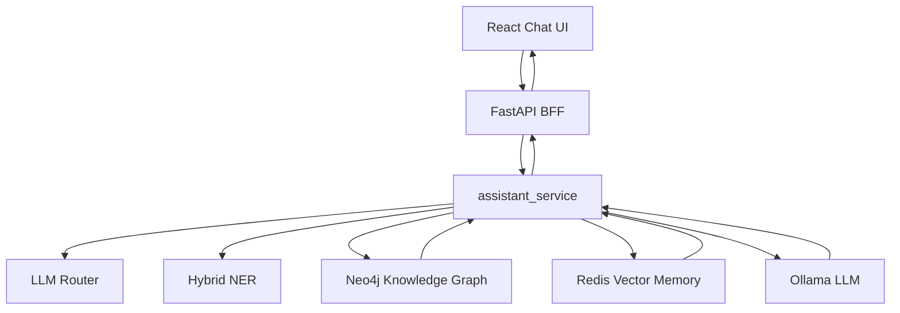

# AI Full-Stack Upgrade Implementation Plan

> **For agentic workers:** REQUIRED SUB-SKILL: Use superpowers:subagent-driven-development (recommended) or superpowers:executing-plans to implement this plan task-by-task. Steps use checkbox (`- [ ]`) syntax for tracking.

**Goal:** Build Phase A of the MedSafetyAssistant upgrade: FastAPI BFF, minimal React Chat UI, streaming answer path, tests, and README narrative.

**Architecture:** Keep the existing `logic_layer/` as the business and AI orchestration core. Add `api.py` as a thin FastAPI BFF over those services, then add a small `frontend/` React app that renders the BFF contract without making medical decisions on the client.

**Tech Stack:** Python, FastAPI, unittest, React, Vite, Neo4j, Redis, Ollama.

---

## Scope Check

This plan implements only Phase A from `docs/superpowers/specs/2026-05-29-ai-fullstack-upgrade-design.md`.

It does not implement the Route B roadmap items: tool registry, prompt management, memory abstraction, trace events, or evaluation set. Those should be separate plans after Phase A is stable.

## File Structure

Create:

- `api.py`: FastAPI BFF. Owns HTTP models, lifespan resource setup, `/api/query`, `/api/query/stream`, `/api/health`, CORS, and structured error responses.
- `test/test_api.py`: API contract tests using direct route calls and mocked dependencies. No live Redis, Neo4j, or Ollama.
- `frontend/package.json`: Minimal Vite React app manifest.
- `frontend/index.html`: Vite HTML entry.
- `frontend/src/main.jsx`: React root render.
- `frontend/src/App.jsx`: Page layout, tab-free single-screen chat experience, local query history.
- `frontend/src/api/client.js`: Backend request helpers for non-streaming and streaming query paths.
- `frontend/src/hooks/useMedicationQuery.js`: React hook for loading/error/result/streaming state.
- `frontend/src/components/QueryForm.jsx`: User input and submit controls.
- `frontend/src/components/ResultPanel.jsx`: Top-level result rendering.
- `frontend/src/components/RouteBadge.jsx`: Route label rendering.
- `frontend/src/components/RiskCard.jsx`: Risk rendering.
- `frontend/src/components/DrugInfoCard.jsx`: Drug information rendering.
- `frontend/src/components/EntityTags.jsx`: Extracted entity rendering.
- `frontend/src/styles.css`: Minimal UI styling.

Modify:

- `.gitignore`: Ignore frontend build artifacts and local dependency folders.
- `requirements.txt`: Add `fastapi` and `uvicorn`; do not add broad framework bundles.
- `logic_layer/llm_service.py`: Extract reusable message building and add a streaming generator.
- `logic_layer/assistant_service.py`: Extract context preparation so `/api/query/stream` can emit metadata before streaming answer text.
- `README.md`: Document full-stack run flow, architecture, honest Agent limitation, demo questions, and dependency policy.

Keep unchanged:

- `app.py`: Streamlit prototype remains runnable.
- `logic_layer/kg_service.py`: KG query behavior remains unchanged.
- `logic_layer/vector_store.py`: Redis memory behavior remains unchanged except through existing public methods.

## Task 1: Backend Dependencies

**Files:**
- Modify: `requirements.txt`

- [ ] **Step 1: Add the FastAPI runtime dependencies**

Append these lines after the Streamlit dependency block:

```txt
# API server
fastapi>=0.115.0,<1.0.0
uvicorn>=0.30.0,<1.0.0
```

- [ ] **Step 2: Install dependencies with explicit approval**

Run only after confirming the install action:

```bash
pip install -r requirements.txt
```

Expected: command exits with status `0`.

- [ ] **Step 3: Verify existing tests still import**

Run:

```bash
python -m unittest test.test_phase1_contracts test.test_assistant_service test.test_public_api_compat -v
```

Expected: all listed tests pass.

- [ ] **Step 4: Commit**

```bash
git add requirements.txt
git commit -m "chore: add FastAPI runtime dependencies"
```

## Task 2: Non-Streaming FastAPI BFF

**Files:**
- Create: `api.py`
- Create: `test/test_api.py`

- [ ] **Step 1: Write failing API contract tests**

Create `test/test_api.py` with:

```python
import asyncio
import unittest
from unittest.mock import patch


SAMPLE_RESULT = {
    "route": "both",
    "history_context": "【相关历史对话】\n1. 用户: 我有高血压",
    "exact_drugs": ["泰诺"],
    "exact_conditions": ["高血压"],
    "llm_drugs": [],
    "llm_conditions": [],
    "final_drugs": ["泰诺"],
    "final_conditions": ["高血压"],
    "risks": [
        {
            "type": "CONTRAINDICATION",
            "drug": "泰诺",
            "condition": "高血压",
            "reason": "测试风险",
            "severity": "RED",
        }
    ],
    "drug_infos": [
        {
            "drug": "泰诺",
            "category": "解热镇痛",
            "function": "测试用途",
            "dosage": "测试剂量",
            "ingredients": "对乙酰氨基酚",
        }
    ],
    "response_text": "测试回答",
    "conversation_saved": True,
    "save_error": None,
}


class ApiContractTests(unittest.TestCase):
    def test_query_medication_returns_complete_service_contract(self):
        from api import QueryRequest, query_medication

        with patch("api.answer_medication_question", return_value=SAMPLE_RESULT) as service:
            response = asyncio.run(query_medication(QueryRequest(question="我有高血压，能吃泰诺吗？")))

        service.assert_called_once()
        self.assertEqual(response["route"], "both")
        self.assertEqual(response["response_text"], "测试回答")
        self.assertEqual(response["risks"][0]["type"], "CONTRAINDICATION")
        self.assertEqual(response["drug_infos"][0]["drug"], "泰诺")
        self.assertEqual(response["final_drugs"], ["泰诺"])
        self.assertTrue(response["conversation_saved"])

    def test_query_medication_rejects_blank_question(self):
        from pydantic import ValidationError
        from api import QueryRequest

        with self.assertRaises(ValidationError):
            QueryRequest(question="   ")

    def test_health_returns_environment_diagnostics(self):
        from api import health

        fake_diagnostics = {
            "ready": True,
            "missing": [],
            "services": {"ollama": {"ready": True}},
        }
        with patch("api.get_environment_diagnostics", return_value=fake_diagnostics):
            response = asyncio.run(health())

        self.assertEqual(response, fake_diagnostics)


if __name__ == "__main__":
    unittest.main()
```

- [ ] **Step 2: Run tests to verify they fail**

Run:

```bash
python -m unittest test.test_api -v
```

Expected: FAIL with `ModuleNotFoundError: No module named 'api'`.

- [ ] **Step 3: Create `api.py` with `/api/query` and `/api/health`**

Create `api.py` with:

```python
# api.py - FastAPI wrapper layer
from contextlib import asynccontextmanager
import traceback

from fastapi import FastAPI, Request
from fastapi.middleware.cors import CORSMiddleware
from fastapi.responses import JSONResponse
from pydantic import BaseModel, Field, field_validator

from logic_layer.assistant_service import DEFAULT_SESSION_ID, answer_medication_question
from logic_layer.health_check import get_environment_diagnostics
from logic_layer.vector_store import VectorStore


class QueryRequest(BaseModel):
    question: str = Field(..., min_length=1)
    session_id: str = DEFAULT_SESSION_ID

    @field_validator("question")
    @classmethod
    def question_must_not_be_blank(cls, value):
        if not value.strip():
            raise ValueError("question must not be blank")
        return value.strip()

    @field_validator("session_id")
    @classmethod
    def session_id_must_not_be_blank(cls, value):
        if not value.strip():
            return DEFAULT_SESSION_ID
        return value.strip()


@asynccontextmanager
async def lifespan(app: FastAPI):
    app.state.vector_store = VectorStore()
    try:
        yield
    finally:
        vector_store = getattr(app.state, "vector_store", None)
        if vector_store is not None:
            vector_store.close()


app = FastAPI(title="MedSafetyAssistant API", version="0.1.0", lifespan=lifespan)

app.add_middleware(
    CORSMiddleware,
    allow_origins=["http://localhost:3000", "http://localhost:5173"],
    allow_credentials=True,
    allow_methods=["*"],
    allow_headers=["*"],
)


@app.exception_handler(Exception)
async def unhandled_exception_handler(request: Request, exc: Exception):
    return JSONResponse(
        status_code=500,
        content={"error": str(exc), "detail": traceback.format_exc()},
    )


def get_vector_store(request: Request | None):
    if request is None:
        return None
    return getattr(request.app.state, "vector_store", None)


@app.post("/api/query")
async def query_medication(payload: QueryRequest, request: Request | None = None):
    vector_store = get_vector_store(request)
    return answer_medication_question(
        payload.question,
        session_id=payload.session_id,
        vector_store=vector_store,
    )


@app.get("/api/health")
async def health():
    return get_environment_diagnostics()
```

- [ ] **Step 4: Run API tests**

Run:

```bash
python -m unittest test.test_api -v
```

Expected: PASS.

- [ ] **Step 5: Run existing backend tests**

Run:

```bash
python -m unittest test.test_phase1_contracts test.test_assistant_service test.test_public_api_compat -v
```

Expected: PASS.

- [ ] **Step 6: Commit**

```bash
git add api.py test/test_api.py
git commit -m "feat: add FastAPI BFF contract"
```

## Task 3: Reusable LLM Message Builder and Streaming Generator

**Files:**
- Modify: `logic_layer/llm_service.py`
- Modify: `test/test_phase1_contracts.py`

- [ ] **Step 1: Add failing tests for reusable messages and streaming fallback**

Append these tests inside `Phase1ContractTests` in `test/test_phase1_contracts.py`:

```python
    def test_build_safety_messages_includes_kg_risks_and_history(self):
        from logic_layer.llm_service import build_safety_messages

        messages = build_safety_messages(
            "泰诺和感康能一起吃吗？",
            [
                {
                    "type": "DUPLICATE_THERAPY",
                    "drug": "泰诺 + 感康",
                    "condition": "药物过量",
                    "ingredient": "对乙酰氨基酚",
                    "reason": "重复成分",
                    "severity": "FATAL",
                }
            ],
            [{"drug": "泰诺", "function": "退热", "dosage": "按说明书"}],
            "【相关历史对话】\n1. 用户: 我吃过感康",
        )

        self.assertEqual(messages[0]["role"], "system")
        self.assertEqual(messages[1]["role"], "user")
        self.assertIn("重复用药风险", messages[1]["content"])
        self.assertIn("相关历史对话", messages[1]["content"])

    def test_stream_safety_response_yields_ollama_chunks(self):
        from logic_layer.llm_service import stream_safety_response

        fake_chunks = [
            {"message": {"content": "结论"}},
            {"message": {"content": "：不要"}},
        ]

        with patch("logic_layer.llm_service.ollama_client.chat", return_value=fake_chunks):
            chunks = list(stream_safety_response("问题", [], [], ""))

        self.assertEqual(chunks, ["结论", "：不要"])

    def test_stream_safety_response_falls_back_when_ollama_fails(self):
        from logic_layer.llm_service import stream_safety_response

        with patch("logic_layer.llm_service.ollama_client.chat", side_effect=RuntimeError("offline")):
            chunks = list(stream_safety_response("未知药能吃吗？", [], [], ""))

        self.assertTrue("无法评估风险" in "".join(chunks))
```

- [ ] **Step 2: Run the targeted tests to verify they fail**

Run:

```bash
python -m unittest test.test_phase1_contracts.Phase1ContractTests.test_build_safety_messages_includes_kg_risks_and_history test.test_phase1_contracts.Phase1ContractTests.test_stream_safety_response_yields_ollama_chunks test.test_phase1_contracts.Phase1ContractTests.test_stream_safety_response_falls_back_when_ollama_fails -v
```

Expected: FAIL with import errors for `build_safety_messages` and `stream_safety_response`.

- [ ] **Step 3: Refactor `logic_layer/llm_service.py`**

Replace the existing `generate_safety_response()` function with the following helper functions and implementation. Keep the existing imports, `ollama_client`, and `extract_entities_with_llm()` unchanged.

```python
def _format_safety_context(risks, drug_infos):
    risk_text = ""
    if risks:
        risk_text = "【检测到严重风险】\n"
        for r in risks:
            if r["type"] == "DUPLICATE_THERAPY":
                risk_text += f"- 重复用药风险：{r['drug']}（均含成分：{r.get('ingredient', '未知成分')}）→ {r['reason']}\n"
            elif r["type"] == "INTERACTION":
                risk_text += f"- 药物相互作用：{r['drug']} → {r['reason']}\n"
            else:
                risk_text += f"- 禁忌/慎用：{r['drug']} + {r['condition']} → {r['reason']}\n"
    else:
        risk_text = "【未检测到图谱内已知风险】\n- 当前知识图谱没有返回重复用药、禁忌或相互作用风险。\n"

    info_text = ""
    if drug_infos:
        info_text = "【药品权威档案】\n"
        for info in drug_infos:
            info_text += f"- {info['drug']}: {info['function']} (用法: {info['dosage']})\n"
    else:
        info_text = "【药品权威档案】\n- 当前知识图谱未返回相关药品档案。\n"

    return risk_text, info_text


def _fallback_safety_response(risks, drug_infos):
    fallback_msg = ""

    if risks:
        fallback_msg += "### 🛑 医生紧急警告\n\n"
        fallback_msg += "**检测到严重的用药风险，请绝对不要按照当前方案服用！**\n\n"
        fallback_msg += "**具体风险如下：**\n"
        for r in risks:
            fallback_msg += f"* **{r['drug']}**: {r['reason']}\n"
        fallback_msg += "\n建议您立即停止混合服用，并咨询线下医生。"
    elif drug_infos:
        fallback_msg += "### ✅ 用药安全评估通过\n\n"
        fallback_msg += "根据当前权威数据库比对，**未发现明显的用药禁忌**。\n\n"
        fallback_msg += "**药品信息参考：**\n"
        for info in drug_infos:
            fallback_msg += f"* **{info['drug']}**: 主要用于{info['function']}。\n"
        fallback_msg += "\n*温馨提示：请严格按照说明书剂量服用，症状未缓解请及时就医。*"
    else:
        fallback_msg += "⚠️ **无法评估风险**\n\n系统暂未收录相关药品信息，请务必咨询专业医师，不要盲目用药。"

    return fallback_msg


def build_safety_messages(user_query, risks, drug_infos, history_context: str = ""):
    risk_text, info_text = _format_safety_context(risks, drug_infos)
    has_risk = "是" if risks else "否"
    has_drug_info = "是" if drug_infos else "否"
    history_section = f"\n{history_context}\n" if history_context else ""

    system_prompt = """
        你是家庭用药安全助手。你只能根据用户问题和下方提供的知识图谱结果回答。

        [回答原则]
        1. 禁止编造：不要添加知识图谱结果中没有出现的副作用、适应症、相互作用或禁忌。
        2. 图谱优先：如果检测到风险，第一句话必须明确“不建议/不要这样服用”，并说明图谱依据。
        3. 谨慎表达：如果未检测到风险，只能说“当前知识图谱未发现已知禁忌”，不能说“绝对安全”。
        4. 证据不足：如果没有药品档案，必须说明“数据库暂未收录相关药品档案，建议咨询医生或药师”。
        5. 输出结构固定为：结论、依据、建议。每部分 1-3 句话，简洁中文。
        """

    user_prompt = f"""
        [用户问题]: {user_query}
        {history_section}
        [结构化标记]:
        - 是否检测到风险: {has_risk}
        - 是否有药品档案: {has_drug_info}

        [知识图谱扫描结果]:
        {risk_text}

        {info_text}

        请严格按照“结论 / 依据 / 建议”生成回答。不要输出知识图谱之外的新医学事实。
        """

    return [
        {"role": "system", "content": system_prompt},
        {"role": "user", "content": user_prompt},
    ]


def generate_safety_response(user_query, risks, drug_infos, history_context: str = ""):
    """
    Generate a final medication-safety answer. If Ollama fails, return the
    rule-based fallback so the app can still show a useful response.
    """
    try:
        response = ollama_client.chat(
            model=Config.OLLAMA_MODEL,
            messages=build_safety_messages(user_query, risks, drug_infos, history_context),
            options={"temperature": 0.1},
        )
        return response["message"]["content"]
    except Exception as e:
        print(f"❌ LLM 生成服务异常: {e}")
        print("🔄 启动规则模板生成机制...")
        return _fallback_safety_response(risks, drug_infos)


def stream_safety_response(user_query, risks, drug_infos, history_context: str = ""):
    """
    Yield answer text chunks from Ollama. If streaming fails before tokens are
    emitted, yield the same rule-based fallback used by the non-streaming path.
    """
    emitted = False
    try:
        stream = ollama_client.chat(
            model=Config.OLLAMA_MODEL,
            messages=build_safety_messages(user_query, risks, drug_infos, history_context),
            options={"temperature": 0.1},
            stream=True,
        )
        for chunk in stream:
            content = chunk.get("message", {}).get("content", "")
            if content:
                emitted = True
                yield content
    except Exception as e:
        print(f"❌ LLM 流式生成服务异常: {e}")
        if not emitted:
            yield _fallback_safety_response(risks, drug_infos)
```

- [ ] **Step 4: Run the targeted tests**

Run:

```bash
python -m unittest test.test_phase1_contracts.Phase1ContractTests.test_build_safety_messages_includes_kg_risks_and_history test.test_phase1_contracts.Phase1ContractTests.test_stream_safety_response_yields_ollama_chunks test.test_phase1_contracts.Phase1ContractTests.test_stream_safety_response_falls_back_when_ollama_fails -v
```

Expected: PASS.

- [ ] **Step 5: Run existing backend tests**

Run:

```bash
python -m unittest test.test_phase1_contracts test.test_assistant_service test.test_public_api_compat test.test_api -v
```

Expected: PASS.

- [ ] **Step 6: Commit**

```bash
git add logic_layer/llm_service.py test/test_phase1_contracts.py
git commit -m "refactor: share safety response prompts"
```

## Task 4: Assistant Context Preparation for Streaming Metadata

**Files:**
- Modify: `logic_layer/assistant_service.py`
- Modify: `test/test_assistant_service.py`

- [ ] **Step 1: Add failing tests for context preparation and persistence helper**

Append these tests inside `AssistantServiceTests` in `test/test_assistant_service.py`:

```python
    def test_prepare_medication_context_returns_metadata_without_generating_answer(self):
        from logic_layer.assistant_service import prepare_medication_context

        kg = FakeKG()
        vector_store = FakeVectorStore()

        with patch("logic_layer.assistant_service.decide_tools", return_value="both"), \
             patch("logic_layer.assistant_service.exact_entity_extraction", return_value=(["泰诺"], ["高血压"])), \
             patch("logic_layer.assistant_service.extract_entities_with_llm", return_value=([], [])), \
             patch("logic_layer.assistant_service.generate_safety_response") as generate:
            context = prepare_medication_context(
                "我有高血压，能吃泰诺吗？",
                session_id="test-session",
                vector_store=vector_store,
                kg=kg,
            )

        generate.assert_not_called()
        self.assertEqual(context["route"], "both")
        self.assertEqual(context["final_drugs"], ["泰诺"])
        self.assertEqual(context["final_conditions"], ["高血压"])
        self.assertEqual(context["risks"][0]["reason"], "测试风险")
        self.assertNotIn("response_text", context)

    def test_save_conversation_result_records_success_and_failure(self):
        from logic_layer.assistant_service import save_conversation_result

        vector_store = FakeVectorStore()
        success = save_conversation_result(
            vector_store,
            "问题",
            "回答",
            "test-session",
        )

        self.assertTrue(success["conversation_saved"])
        self.assertIsNone(success["save_error"])
        self.assertEqual(vector_store.saved, ("问题", "回答", "test-session"))

        class FailingVectorStore(FakeVectorStore):
            def store_conversation(self, user_query, assistant_response, session_id):
                raise RuntimeError("redis offline")

        failure = save_conversation_result(
            FailingVectorStore(),
            "问题",
            "回答",
            "test-session",
        )

        self.assertFalse(failure["conversation_saved"])
        self.assertEqual(failure["save_error"], "redis offline")
```

- [ ] **Step 2: Run targeted tests to verify they fail**

Run:

```bash
python -m unittest test.test_assistant_service.AssistantServiceTests.test_prepare_medication_context_returns_metadata_without_generating_answer test.test_assistant_service.AssistantServiceTests.test_save_conversation_result_records_success_and_failure -v
```

Expected: FAIL with import errors for `prepare_medication_context` and `save_conversation_result`.

- [ ] **Step 3: Replace `logic_layer/assistant_service.py` with context helpers**

Use this complete file:

```python
"""
Application service boundary for the medication assistant.

The Streamlit UI and FastAPI BFF both call this module. UI code should render
results; this module owns backend orchestration.
"""

from logic_layer.entity_utils import exact_entity_extraction
from logic_layer.kg_service import MedicalKG
from logic_layer.llm_service import generate_safety_response, extract_entities_with_llm
from logic_layer.router_service import decide_tools

DEFAULT_SESSION_ID = "shared"


def prepare_medication_context(prompt, session_id=DEFAULT_SESSION_ID, vector_store=None, kg=None):
    """
    Run retrieval, routing, entity extraction, and KG checks without generating
    the final answer. This lets streaming APIs emit metadata before answer text.
    """
    route = decide_tools(prompt)

    history_context = ""
    if route in ("search_history", "both") and vector_store and vector_store.redis_client:
        history_context = vector_store.get_conversation_context(prompt, session_id, top_k=3)

    exact_drugs = []
    exact_conditions = []
    llm_drugs = []
    llm_conditions = []
    final_drugs = []
    final_conditions = []
    risks = []
    drug_infos = []

    if route in ("query_kg", "both"):
        exact_drugs, exact_conditions = exact_entity_extraction(prompt)
        llm_drugs, llm_conditions = extract_entities_with_llm(prompt)

        final_drugs = list(set(exact_drugs + llm_drugs))
        final_conditions = list(set(exact_conditions + llm_conditions))

        if final_drugs or final_conditions:
            risks = kg.check_safety(final_drugs, final_conditions)
            drug_infos = kg.get_drug_info(final_drugs)

    return {
        "route": route,
        "history_context": history_context,
        "exact_drugs": exact_drugs,
        "exact_conditions": exact_conditions,
        "llm_drugs": llm_drugs,
        "llm_conditions": llm_conditions,
        "final_drugs": final_drugs,
        "final_conditions": final_conditions,
        "risks": risks,
        "drug_infos": drug_infos,
    }


def save_conversation_result(vector_store, prompt, response_text, session_id=DEFAULT_SESSION_ID):
    conversation_saved = False
    save_error = None
    if vector_store and vector_store.redis_client:
        try:
            vector_store.store_conversation(prompt, response_text, session_id)
            conversation_saved = True
        except Exception as exc:
            save_error = str(exc)

    return {
        "conversation_saved": conversation_saved,
        "save_error": save_error,
    }


def answer_medication_question(prompt, session_id=DEFAULT_SESSION_ID, vector_store=None, kg=None):
    """
    Run the backend medication-safety pipeline for one user prompt.

    The returned dictionary preserves the app's intermediate values so UIs can
    render route decisions, entities, risks, evidence, and persistence status.
    """
    owns_kg = kg is None
    kg = kg or MedicalKG()

    try:
        context = prepare_medication_context(
            prompt,
            session_id=session_id,
            vector_store=vector_store,
            kg=kg,
        )
        response_text = generate_safety_response(
            prompt,
            context["risks"],
            context["drug_infos"],
            context["history_context"],
        )
        save_result = save_conversation_result(
            vector_store,
            prompt,
            response_text,
            session_id,
        )
        return {
            **context,
            "response_text": response_text,
            **save_result,
        }
    finally:
        if owns_kg:
            kg.close()
```

- [ ] **Step 4: Run targeted tests**

Run:

```bash
python -m unittest test.test_assistant_service.AssistantServiceTests.test_prepare_medication_context_returns_metadata_without_generating_answer test.test_assistant_service.AssistantServiceTests.test_save_conversation_result_records_success_and_failure -v
```

Expected: PASS.

- [ ] **Step 5: Run all backend unit tests**

Run:

```bash
python -m unittest discover -s test -p "test_*.py" -v
```

Expected: PASS.

- [ ] **Step 6: Commit**

```bash
git add logic_layer/assistant_service.py test/test_assistant_service.py
git commit -m "refactor: prepare assistant context for streaming"
```

## Task 5: Streaming FastAPI Endpoint

**Files:**
- Modify: `api.py`
- Modify: `test/test_api.py`

- [ ] **Step 1: Add failing streaming endpoint tests**

Append this test inside `ApiContractTests` in `test/test_api.py`:

```python
    def test_stream_query_events_emit_meta_tokens_done_and_save_status(self):
        from api import QueryRequest, stream_query_events

        context = dict(SAMPLE_RESULT)
        context.pop("response_text")
        context.pop("conversation_saved")
        context.pop("save_error")

        with patch("api.MedicalKG") as kg_class, \
             patch("api.prepare_medication_context", return_value=context), \
             patch("api.stream_safety_response", return_value=iter(["结论", "：不要"])), \
             patch("api.save_conversation_result", return_value={"conversation_saved": True, "save_error": None}):
            kg_class.return_value.close.return_value = None
            events = list(stream_query_events(QueryRequest(question="问题", session_id="s1"), vector_store=None))

        self.assertIn('"type": "meta"', events[0])
        self.assertIn('"route": "both"', events[0])
        self.assertIn('"type": "token"', events[1])
        self.assertIn("结论", events[1])
        self.assertIn('"type": "token"', events[2])
        self.assertIn("：不要", events[2])
        self.assertIn('"type": "done"', events[3])
        self.assertIn('"conversation_saved": true', events[3])
```

- [ ] **Step 2: Run the streaming test to verify it fails**

Run:

```bash
python -m unittest test.test_api.ApiContractTests.test_stream_query_events_emit_meta_tokens_done_and_save_status -v
```

Expected: FAIL with import error for `stream_query_events`.

- [ ] **Step 3: Update imports and add streaming route in `api.py`**

Update imports in `api.py`:

```python
import json
```

Replace the assistant service import with:

```python
from logic_layer.assistant_service import (
    DEFAULT_SESSION_ID,
    answer_medication_question,
    prepare_medication_context,
    save_conversation_result,
)
from logic_layer.kg_service import MedicalKG
from logic_layer.llm_service import stream_safety_response
```

Add this code after `query_medication()`:

```python
def sse_event(payload: dict):
    return f"data: {json.dumps(payload, ensure_ascii=False)}\n\n"


def stream_query_events(payload: QueryRequest, vector_store=None):
    kg = MedicalKG()
    answer_parts = []
    try:
        context = prepare_medication_context(
            payload.question,
            session_id=payload.session_id,
            vector_store=vector_store,
            kg=kg,
        )
        yield sse_event({"type": "meta", **context})

        for token in stream_safety_response(
            payload.question,
            context["risks"],
            context["drug_infos"],
            context["history_context"],
        ):
            answer_parts.append(token)
            yield sse_event({"type": "token", "content": token})

        response_text = "".join(answer_parts)
        save_result = save_conversation_result(
            vector_store,
            payload.question,
            response_text,
            payload.session_id,
        )
        yield sse_event({"type": "done", **save_result})
    except Exception as exc:
        yield sse_event({"type": "error", "error": str(exc)})
    finally:
        kg.close()
```

Add `StreamingResponse` to the responses import:

```python
from fastapi.responses import JSONResponse, StreamingResponse
```

Add this route after `stream_query_events()`:

```python
@app.post("/api/query/stream")
async def stream_medication_query(payload: QueryRequest, request: Request | None = None):
    vector_store = get_vector_store(request)
    return StreamingResponse(
        stream_query_events(payload, vector_store=vector_store),
        media_type="text/event-stream",
    )
```

- [ ] **Step 4: Run streaming API tests**

Run:

```bash
python -m unittest test.test_api -v
```

Expected: PASS.

- [ ] **Step 5: Run all backend unit tests**

Run:

```bash
python -m unittest discover -s test -p "test_*.py" -v
```

Expected: PASS.

- [ ] **Step 6: Commit**

```bash
git add api.py test/test_api.py
git commit -m "feat: add streaming query endpoint"
```

## Task 6: Minimal React App Scaffold

**Files:**
- Modify: `.gitignore`
- Create: `frontend/package.json`
- Create: `frontend/index.html`
- Create: `frontend/src/main.jsx`
- Create: `frontend/src/styles.css`

- [ ] **Step 1: Add frontend generated files to `.gitignore`**

Append these lines near the existing environment and build-output sections:

```gitignore
# Frontend
frontend/node_modules/
frontend/dist/
```

- [ ] **Step 2: Create `frontend/package.json`**

```json
{
  "scripts": {
    "dev": "vite --host 127.0.0.1 --port 5173",
    "build": "vite build",
    "preview": "vite preview --host 127.0.0.1 --port 5173"
  },
  "dependencies": {
    "react": "^18.3.1",
    "react-dom": "^18.3.1"
  },
  "devDependencies": {
    "@vitejs/plugin-react": "^4.3.0",
    "vite": "^5.4.0"
  }
}
```

- [ ] **Step 3: Create `frontend/index.html`**

```html
<!doctype html>
<html lang="zh-CN">
  <head>
    <meta charset="UTF-8" />
    <meta name="viewport" content="width=device-width, initial-scale=1.0" />
    <title>MedSafetyAssistant</title>
  </head>
  <body>
    <div id="root"></div>
    <script type="module" src="/src/main.jsx"></script>
  </body>
</html>
```

- [ ] **Step 4: Create `frontend/src/main.jsx`**

```jsx
import React from 'react';
import { createRoot } from 'react-dom/client';
import App from './App.jsx';
import './styles.css';

createRoot(document.getElementById('root')).render(
  <React.StrictMode>
    <App />
  </React.StrictMode>,
);
```

- [ ] **Step 5: Create `frontend/src/styles.css`**

```css
:root {
  font-family: Inter, ui-sans-serif, system-ui, -apple-system, BlinkMacSystemFont, "Segoe UI", sans-serif;
  color: #172026;
  background: #f6f8fb;
}

* {
  box-sizing: border-box;
}

body {
  margin: 0;
  min-width: 320px;
}

button,
textarea {
  font: inherit;
}

.app-shell {
  min-height: 100vh;
  display: grid;
  grid-template-columns: 240px minmax(0, 1fr);
}

.sidebar {
  border-right: 1px solid #d8e0ea;
  background: #ffffff;
  padding: 20px 16px;
}

.main {
  padding: 28px;
}

.content {
  max-width: 880px;
  margin: 0 auto;
}

.title {
  margin: 0;
  font-size: 28px;
  line-height: 1.2;
}

.subtitle {
  margin: 8px 0 20px;
  color: #5f6f80;
}

.disclaimer {
  border: 1px solid #f0b4b4;
  background: #fff0f0;
  color: #8b1e1e;
  padding: 12px 14px;
  border-radius: 8px;
  margin-bottom: 20px;
}

.panel {
  background: #ffffff;
  border: 1px solid #d8e0ea;
  border-radius: 8px;
  padding: 18px;
  margin-bottom: 18px;
}

.query-form textarea {
  width: 100%;
  min-height: 108px;
  resize: vertical;
  border: 1px solid #bdc9d6;
  border-radius: 8px;
  padding: 12px;
}

.actions {
  display: flex;
  gap: 10px;
  justify-content: flex-end;
  margin-top: 12px;
}

.primary-button {
  border: 0;
  border-radius: 8px;
  padding: 10px 16px;
  background: #1d6fd8;
  color: #ffffff;
  cursor: pointer;
}

.primary-button:disabled {
  background: #9abce5;
  cursor: not-allowed;
}

.error {
  border: 1px solid #e9a4a4;
  background: #fff5f5;
  color: #9b1c1c;
  border-radius: 8px;
  padding: 12px;
  margin-bottom: 18px;
}

.history-list {
  display: grid;
  gap: 8px;
}

.history-item {
  border: 1px solid #d8e0ea;
  background: #f8fafc;
  border-radius: 8px;
  padding: 9px;
  text-align: left;
  cursor: pointer;
  color: #314255;
}

.history-empty {
  color: #7a8999;
  font-size: 14px;
}

.tag-row {
  display: flex;
  flex-wrap: wrap;
  gap: 8px;
  margin: 8px 0 14px;
}

.tag {
  display: inline-flex;
  align-items: center;
  border-radius: 999px;
  padding: 4px 10px;
  font-size: 13px;
  background: #eef3f8;
  color: #2f4358;
}

.route-badge {
  display: inline-flex;
  border-radius: 999px;
  padding: 5px 11px;
  font-size: 13px;
  font-weight: 700;
}

.route-query_kg {
  background: #e7f0ff;
  color: #1858ad;
}

.route-search_history {
  background: #e7f8ed;
  color: #176b36;
}

.route-both {
  background: #f0e9ff;
  color: #6231b2;
}

.risk-card {
  border: 1px solid #efb1b1;
  background: #fff6f6;
  border-radius: 8px;
  padding: 12px;
  margin: 10px 0;
}

.risk-card.fatal {
  border-color: #d11f1f;
}

.drug-card {
  border: 1px solid #d8e0ea;
  background: #f8fafc;
  border-radius: 8px;
  padding: 12px;
  margin: 10px 0;
}

.answer {
  white-space: pre-wrap;
  line-height: 1.65;
  background: #f8fafc;
  border-radius: 8px;
  padding: 14px;
}

@media (max-width: 760px) {
  .app-shell {
    grid-template-columns: 1fr;
  }

  .sidebar {
    border-right: 0;
    border-bottom: 1px solid #d8e0ea;
  }

  .main {
    padding: 18px;
  }
}
```

- [ ] **Step 6: Install frontend dependencies with explicit approval**

Run only after confirming the install action:

```bash
cd frontend
npm install
```

Expected: command exits with status `0` and creates `frontend/package-lock.json`.

- [ ] **Step 7: Run build to verify scaffold wiring**

Run:

```bash
cd frontend
npm run build
```

Expected: FAIL with an import error for missing `./App.jsx`. This confirms the Vite scaffold is active and ready for app files.

- [ ] **Step 8: Commit scaffold**

```bash
git add .gitignore frontend/package.json frontend/package-lock.json frontend/index.html frontend/src/main.jsx frontend/src/styles.css
git commit -m "feat: scaffold React frontend"
```

## Task 7: React API Client and Query Hook

**Files:**
- Create: `frontend/src/api/client.js`
- Create: `frontend/src/hooks/useMedicationQuery.js`

- [ ] **Step 1: Create `frontend/src/api/client.js`**

```js
const API_BASE_URL = import.meta.env.VITE_API_BASE_URL || 'http://localhost:8000';

export async function submitMedicationQuery(question, sessionId = 'shared') {
  const response = await fetch(`${API_BASE_URL}/api/query`, {
    method: 'POST',
    headers: { 'Content-Type': 'application/json' },
    body: JSON.stringify({ question, session_id: sessionId }),
  });

  const data = await response.json();
  if (!response.ok) {
    throw new Error(data.error || data.detail || '查询失败');
  }
  return data;
}

function parseSsePayload(line) {
  if (!line.startsWith('data: ')) {
    return null;
  }
  return JSON.parse(line.slice(6));
}

export async function streamMedicationQuery(question, callbacks, sessionId = 'shared') {
  const response = await fetch(`${API_BASE_URL}/api/query/stream`, {
    method: 'POST',
    headers: { 'Content-Type': 'application/json' },
    body: JSON.stringify({ question, session_id: sessionId }),
  });

  if (!response.ok || !response.body) {
    throw new Error('流式查询启动失败');
  }

  const reader = response.body.getReader();
  const decoder = new TextDecoder('utf-8');
  let buffer = '';

  while (true) {
    const { value, done } = await reader.read();
    if (done) {
      break;
    }

    buffer += decoder.decode(value, { stream: true });
    const parts = buffer.split('\n\n');
    buffer = parts.pop() || '';

    for (const part of parts) {
      const payload = parseSsePayload(part.trim());
      if (!payload) {
        continue;
      }
      if (payload.type === 'meta') {
        callbacks.onMeta(payload);
      } else if (payload.type === 'token') {
        callbacks.onToken(payload.content || '');
      } else if (payload.type === 'done') {
        callbacks.onDone(payload);
      } else if (payload.type === 'error') {
        throw new Error(payload.error || '流式查询失败');
      }
    }
  }
}
```

- [ ] **Step 2: Create `frontend/src/hooks/useMedicationQuery.js`**

```js
import { useCallback, useState } from 'react';
import { streamMedicationQuery, submitMedicationQuery } from '../api/client.js';

export function useMedicationQuery() {
  const [result, setResult] = useState(null);
  const [loading, setLoading] = useState(false);
  const [streaming, setStreaming] = useState(false);
  const [error, setError] = useState('');

  const submit = useCallback(async (question, options = { stream: true }) => {
    if (loading || streaming) {
      return null;
    }

    setError('');
    setResult(null);

    if (options.stream) {
      setStreaming(true);
      let meta = null;
      let responseText = '';
      try {
        await streamMedicationQuery(question, {
          onMeta(payload) {
            meta = { ...payload };
            delete meta.type;
            setResult({ ...meta, response_text: '' });
          },
          onToken(content) {
            responseText += content;
            setResult((current) => ({
              ...(current || meta || {}),
              response_text: responseText,
            }));
          },
          onDone(payload) {
            setResult((current) => ({
              ...(current || meta || {}),
              response_text: responseText,
              conversation_saved: Boolean(payload.conversation_saved),
              save_error: payload.save_error || null,
            }));
          },
        });
        return { ...(meta || {}), response_text: responseText };
      } catch (err) {
        setError(err.message || '查询失败');
        return null;
      } finally {
        setStreaming(false);
      }
    }

    setLoading(true);
    try {
      const data = await submitMedicationQuery(question);
      setResult(data);
      return data;
    } catch (err) {
      setError(err.message || '查询失败');
      return null;
    } finally {
      setLoading(false);
    }
  }, [loading, streaming]);

  return {
    result,
    loading,
    streaming,
    error,
    submit,
  };
}
```

- [ ] **Step 3: Run frontend build to confirm expected missing App remains**

Run:

```bash
cd frontend
npm run build
```

Expected: FAIL with an import error for missing `./App.jsx`, not errors in `client.js` or `useMedicationQuery.js`.

- [ ] **Step 4: Commit**

```bash
git add frontend/src/api/client.js frontend/src/hooks/useMedicationQuery.js
git commit -m "feat: add frontend API query hook"
```

## Task 8: React Components and App Screen

**Files:**
- Create: `frontend/src/components/QueryForm.jsx`
- Create: `frontend/src/components/RouteBadge.jsx`
- Create: `frontend/src/components/EntityTags.jsx`
- Create: `frontend/src/components/RiskCard.jsx`
- Create: `frontend/src/components/DrugInfoCard.jsx`
- Create: `frontend/src/components/ResultPanel.jsx`
- Create: `frontend/src/App.jsx`

- [ ] **Step 1: Create `frontend/src/components/QueryForm.jsx`**

```jsx
import { useState } from 'react';

export default function QueryForm({ initialQuestion, loading, onSubmit }) {
  const [question, setQuestion] = useState(initialQuestion || '');

  function submit() {
    const trimmed = question.trim();
    if (!trimmed || loading) {
      return;
    }
    onSubmit(trimmed);
  }

  function handleKeyDown(event) {
    if ((event.ctrlKey || event.metaKey) && event.key === 'Enter') {
      submit();
    }
  }

  return (
    <div className="panel query-form">
      <textarea
        value={question}
        onChange={(event) => setQuestion(event.target.value)}
        onKeyDown={handleKeyDown}
        placeholder="请输入用药问题，例如：我有高血压，能吃泰诺吗？"
      />
      <div className="actions">
        <button className="primary-button" type="button" disabled={loading || !question.trim()} onClick={submit}>
          {loading ? '分析中...' : '开始分析'}
        </button>
      </div>
    </div>
  );
}
```

- [ ] **Step 2: Create `frontend/src/components/RouteBadge.jsx`**

```jsx
const ROUTE_LABELS = {
  query_kg: '知识图谱检索',
  search_history: '历史对话检索',
  both: '混合检索',
};

export default function RouteBadge({ route }) {
  const safeRoute = route || 'both';
  return (
    <span className={`route-badge route-${safeRoute}`}>
      {ROUTE_LABELS[safeRoute] || safeRoute}
    </span>
  );
}
```

- [ ] **Step 3: Create `frontend/src/components/EntityTags.jsx`**

```jsx
function TagGroup({ title, values }) {
  const items = values || [];
  return (
    <div>
      <strong>{title}</strong>
      <div className="tag-row">
        {items.length === 0 ? <span className="tag">未识别</span> : items.map((item) => <span className="tag" key={item}>{item}</span>)}
      </div>
    </div>
  );
}

export default function EntityTags({ drugs, conditions }) {
  return (
    <div>
      <TagGroup title="药品实体" values={drugs} />
      <TagGroup title="状态实体" values={conditions} />
    </div>
  );
}
```

- [ ] **Step 4: Create `frontend/src/components/RiskCard.jsx`**

```jsx
const TYPE_LABELS = {
  DUPLICATE_THERAPY: '重复成分',
  CONTRAINDICATION: '用药禁忌',
  INTERACTION: '药物相互作用',
};

export default function RiskCard({ risk }) {
  const fatal = risk.severity === 'FATAL';
  return (
    <div className={`risk-card ${fatal ? 'fatal' : ''}`}>
      <strong>{TYPE_LABELS[risk.type] || risk.type}</strong>
      <p>{risk.drug}{risk.condition ? ` + ${risk.condition}` : ''}</p>
      {risk.ingredient ? <p>重复成分：{risk.ingredient}</p> : null}
      <p>{risk.reason}</p>
      <span className="tag">严重程度：{risk.severity || 'UNKNOWN'}</span>
    </div>
  );
}
```

- [ ] **Step 5: Create `frontend/src/components/DrugInfoCard.jsx`**

```jsx
export default function DrugInfoCard({ info }) {
  return (
    <div className="drug-card">
      <strong>{info.drug}</strong>
      <div className="tag-row">
        <span className="tag">{info.category || '未分类'}</span>
        <span className="tag">成分：{info.ingredients || '未记录'}</span>
      </div>
      <p>{info.function || '暂无功能说明'}</p>
      <p>用法用量：{info.dosage || '请参考说明书'}</p>
    </div>
  );
}
```

- [ ] **Step 6: Create `frontend/src/components/ResultPanel.jsx`**

```jsx
import DrugInfoCard from './DrugInfoCard.jsx';
import EntityTags from './EntityTags.jsx';
import RiskCard from './RiskCard.jsx';
import RouteBadge from './RouteBadge.jsx';

export default function ResultPanel({ result }) {
  if (!result) {
    return null;
  }

  const risks = result.risks || [];
  const drugInfos = result.drug_infos || [];

  return (
    <div className="panel">
      <h2>分析结果</h2>
      <RouteBadge route={result.route} />

      <h3>识别对象</h3>
      <EntityTags drugs={result.final_drugs || []} conditions={result.final_conditions || []} />

      <h3>风险扫描</h3>
      {risks.length === 0 ? (
        <div className="drug-card">当前知识图谱未发现已知禁忌。请注意这不等于绝对安全。</div>
      ) : (
        risks.map((risk, index) => <RiskCard key={`${risk.type}-${risk.drug}-${index}`} risk={risk} />)
      )}

      <h3>回答</h3>
      <div className="answer">{result.response_text || '正在生成回答...'}</div>

      {drugInfos.length > 0 ? (
        <>
          <h3>药品档案</h3>
          {drugInfos.map((info) => <DrugInfoCard key={info.drug} info={info} />)}
        </>
      ) : null}

      {result.conversation_saved ? <p>对话已保存到历史记忆。</p> : null}
      {result.save_error ? <p>保存历史失败：{result.save_error}</p> : null}
    </div>
  );
}
```

- [ ] **Step 7: Create `frontend/src/App.jsx`**

```jsx
import { useState } from 'react';
import QueryForm from './components/QueryForm.jsx';
import ResultPanel from './components/ResultPanel.jsx';
import { useMedicationQuery } from './hooks/useMedicationQuery.js';

export default function App() {
  const [history, setHistory] = useState([]);
  const [selectedQuestion, setSelectedQuestion] = useState('');
  const { result, loading, streaming, error, submit } = useMedicationQuery();
  const busy = loading || streaming;

  async function handleSubmit(question) {
    setSelectedQuestion(question);
    const data = await submit(question, { stream: true });
    if (data) {
      setHistory((items) => [question, ...items.filter((item) => item !== question)].slice(0, 8));
    }
  }

  return (
    <div className="app-shell">
      <aside className="sidebar">
        <h2>查询历史</h2>
        <div className="history-list">
          {history.length === 0 ? <div className="history-empty">暂无本地查询历史</div> : null}
          {history.map((item) => (
            <button className="history-item" type="button" key={item} onClick={() => setSelectedQuestion(item)}>
              {item}
            </button>
          ))}
        </div>
      </aside>
      <main className="main">
        <div className="content">
          <h1 className="title">家庭用药安全助手</h1>
          <p className="subtitle">轻量 Agentic Workflow：知识图谱、历史记忆与大模型回答</p>
          <div className="disclaimer">
            法律声明：本系统为科研演示原型，数据覆盖有限。用药建议不具法律效力，禁止作为临床决策唯一依据。
          </div>
          <QueryForm key={selectedQuestion} initialQuestion={selectedQuestion} loading={busy} onSubmit={handleSubmit} />
          {error ? <div className="error">{error}</div> : null}
          <ResultPanel result={result} />
        </div>
      </main>
    </div>
  );
}
```

- [ ] **Step 8: Build frontend**

Run:

```bash
cd frontend
npm run build
```

Expected: PASS and a `frontend/dist/` directory is created.

- [ ] **Step 9: Commit**

```bash
git add frontend/src/App.jsx frontend/src/components frontend/src/styles.css
git commit -m "feat: build medication chat UI"
```

## Task 9: README Full-Stack Narrative

**Files:**
- Modify: `README.md`

- [ ] **Step 1: Update README architecture and run commands**

Add these sections after the existing quick start:

```markdown
## Full-Stack Mode

The original Streamlit app remains available as a prototype UI. The full-stack mode adds a FastAPI BFF and React Chat UI over the same backend orchestration service.

### Backend

```bash
pip install -r requirements.txt
uvicorn api:app --reload --port 8000
```

API endpoints:

- `POST /api/query` - non-streaming medication safety query.
- `POST /api/query/stream` - SSE-style streaming query. Metadata is emitted first, followed by answer tokens.
- `GET /api/health` - non-blocking configuration diagnostics for Neo4j, Redis, and Ollama.

### Frontend

```bash
cd frontend
npm install
npm run dev
```

Open `http://localhost:5173`.

### Demo Questions

- `泰诺和感康能一起吃吗？`
- `我喝酒了，还能吃头孢吗？`
- `布洛芬和阿司匹林能一起吃吗？`
- `那我之前问过的药还能继续吃吗？`

## Interview Narrative

This project is best described as a lightweight Agentic AI full-stack system for a high-risk medication-safety scenario.

It is not a general-purpose Agent platform. The current Agent layer is intentionally small and explainable: an LLM router chooses between knowledge-graph retrieval, Redis memory retrieval, or both; the backend executes fixed tools; the UI displays structured evidence and the final answer.

The next engineering step is to extract a tool registry, prompt templates, trace events, and a regression evaluation set after the full-stack base is stable.
```

- [ ] **Step 2: Add full-stack architecture diagram**

Replace or extend the architecture diagram with:

```markdown

```

- [ ] **Step 3: Verify README renders code fences correctly**

Run:

```bash
python -m unittest discover -s test -p "test_*.py" -v
```

Expected: PASS.

- [ ] **Step 4: Commit**

```bash
git add README.md
git commit -m "docs: describe full-stack AI application flow"
```

## Task 10: Manual Verification and Final Commit

**Files:**
- No new files unless verification exposes a small fix.

- [ ] **Step 1: Run backend tests**

Run:

```bash
python -m unittest discover -s test -p "test_*.py" -v
```

Expected: PASS.

- [ ] **Step 2: Run frontend build**

Run:

```bash
cd frontend
npm run build
```

Expected: PASS.

- [ ] **Step 3: Start backend**

Run:

```bash
uvicorn api:app --reload --port 8000
```

Expected: server starts on `http://127.0.0.1:8000`.

- [ ] **Step 4: Verify health endpoint in another terminal**

Run:

```bash
curl http://localhost:8000/api/health
```

Expected: JSON with keys `ready`, `missing`, and `services`.

- [ ] **Step 5: Verify non-streaming query**

Run:

```bash
curl -X POST http://localhost:8000/api/query \
  -H "Content-Type: application/json" \
  -d '{"question": "泰诺和感康能一起吃吗？", "session_id": "shared"}'
```

Expected: JSON with keys `route`, `risks`, `drug_infos`, `response_text`, `conversation_saved`, and `save_error`.

- [ ] **Step 6: Verify streaming query**

Run:

```bash
curl -N -X POST http://localhost:8000/api/query/stream \
  -H "Content-Type: application/json" \
  -d '{"question": "泰诺和感康能一起吃吗？", "session_id": "shared"}'
```

Expected: `data:` events with `type` values `meta`, `token`, and `done`. If Ollama is offline, expect a fallback answer token event instead of a crash.

- [ ] **Step 7: Start frontend**

Run:

```bash
cd frontend
npm run dev
```

Expected: Vite prints a local URL on port `5173`.

- [ ] **Step 8: Browser smoke test**

Open `http://localhost:5173` and submit:

```txt
泰诺和感康能一起吃吗？
```

Expected: the UI shows a route badge, extracted entities, risk card or safe-state message, answer text, and drug information when available.

- [ ] **Step 9: Check git status**

Run:

```bash
git status --short
```

Expected: no unstaged files. `frontend/dist/` and `frontend/node_modules/` are ignored by `.gitignore`.

- [ ] **Step 10: Record verification result in the final response**

Do not create a commit in this step. Report the exact backend test command, frontend build command, and manual endpoint/browser checks that passed.

## Execution Notes

- Before implementation, use `superpowers:using-git-worktrees` if an isolated workspace is needed.
- Do not install dependencies without explicit approval.
- Keep each task committed separately.
- If a test fails unexpectedly, switch to `superpowers:systematic-debugging` before changing code.
- Before claiming completion, use `superpowers:verification-before-completion`.
