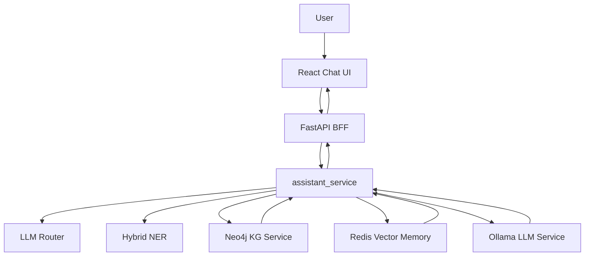

# MedSafetyAssistant AI Full-Stack Upgrade Design

Date: 2026-05-29

## Purpose

Upgrade MedSafetyAssistant from a Streamlit research prototype into a defensible AI Coding full-stack project for AI application development internship interviews.

The project narrative should be:

> A lightweight Agentic AI full-stack system for a high-risk medication-safety scenario.

It should not be described as a general-purpose Agent platform. The defensible scope is a domain AI application with explicit routing, tool use, memory retrieval, evidence display, and engineering tests.

## Current Context

The existing project already has useful AI application foundations:

- Streamlit UI in `app.py`.
- Backend orchestration in `logic_layer/assistant_service.py`.
- Minimal LLM router in `logic_layer/router_service.py`.
- Hybrid entity extraction in `logic_layer/entity_utils.py` and `logic_layer/llm_service.py`.
- Neo4j medication knowledge graph in `logic_layer/kg_service.py`.
- Redis-backed conversation memory and vector retrieval in `logic_layer/vector_store.py`.
- Tests around assistant contracts and service behavior under `test/`.

The main gap is presentation and engineering shape. The current app works as a prototype, but it does not yet demonstrate a clear full-stack architecture, API contract, React front end, or interview-ready BFF story.

## Target Positioning

The target internship JD values AI Coding, full-stack thinking, BFF development, Chat UI, Agent/tool workflows, memory management, and code quality.

This project should map to those requirements as follows:

- AI Coding evidence: document design decisions, implementation plan, tests, and review checkpoints.
- Full-stack evidence: FastAPI BFF plus React UI over existing Python AI services.
- BFF evidence: HTTP API wraps orchestration and returns UI-friendly metadata.
- Chat UI evidence: React query interface, streaming answer rendering, route/risk/evidence panels.
- Agentic workflow evidence: lightweight router chooses between KG, memory, or both.
- Memory evidence: Redis vector conversation retrieval remains visible in the UI and API response.
- Engineering evidence: explicit contracts, tests, health checks, and README architecture.

## Roadmap Choice

Use Route B as the overall roadmap, but implement Route A first.

Route A is the first deliverable:

- FastAPI BFF.
- React Chat UI.
- Streaming response path.
- Health endpoint.
- Architecture README updates.
- Focused backend and contract tests.

Route B is the later upgrade:

- Tool registry.
- Prompt template management.
- Memory abstraction.
- Trace events.
- Small regression evaluation set.

The first implementation cycle must not include Route B features unless Route A is already stable.

## Phase A Scope

### In Scope

1. Add a FastAPI BFF layer.
   - `POST /api/query` calls `answer_medication_question()`.
   - `GET /api/health` returns environment diagnostics from the existing health-check logic.
   - CORS allows the local React dev server.
   - Response JSON preserves route, entities, risks, drug infos, history context, answer text, and save status.

2. Add a minimal React front end.
   - Query input and submit flow.
   - Result panel showing route decision, extracted entities, risks, drug facts, and final answer.
   - Error and loading states.
   - Simple local query history for demo usability.

3. Add streaming answer support.
   - Keep the existing non-streaming `/api/query` contract.
   - Add a separate streaming endpoint or streaming-compatible path.
   - Send metadata first, then answer tokens, then completion.
   - Keep implementation simple enough to explain in an interview.

4. Preserve Streamlit during the transition.
   - Do not delete `app.py`.
   - Treat Streamlit as the original prototype and React as the full-stack presentation layer.

5. Add engineering documentation.
   - README should explain the full-stack architecture.
   - Include a truthful comparison between current minimal Agent routing and a full ReAct-style Agent.
   - Include local run commands and demo questions.

6. Add focused tests.
   - API contract tests for request/response shape.
   - Service tests should continue to isolate external systems using fakes or mocks.
   - Avoid requiring live Neo4j, Redis, or Ollama for normal unit tests.

### Out of Scope for Phase A

- General-purpose Agent framework.
- Generative UI.
- Low-code CRUD generation.
- Docker deployment.
- Analytics dashboard.
- Design system or component library.
- TypeScript migration.
- Complex frontend state management.
- Authentication, user accounts, or multi-tenant sessions.

## Architecture

Phase A architecture:

The BFF does not duplicate business logic. It translates HTTP requests into existing service calls, manages shared app resources such as `VectorStore`, and returns UI-friendly JSON.

## Component Boundaries

### FastAPI BFF

Responsibilities:

- Validate request payloads.
- Manage API lifecycle resources.
- Call existing orchestration functions.
- Return stable JSON contracts.
- Translate unexpected exceptions into API errors.

Non-responsibilities:

- Reimplement KG queries.
- Reimplement entity extraction.
- Own prompt behavior.
- Own frontend rendering decisions.

### React UI

Responsibilities:

- Collect user questions.
- Display route, entities, risks, evidence, and final answer.
- Show loading, error, and streaming states.
- Keep local demo history.

Non-responsibilities:

- Make medical decisions.
- Infer risks on the client.
- Hide the structured evidence returned by the backend.

### Existing Logic Layer

Responsibilities remain unchanged:

- `assistant_service.py` orchestrates the AI workflow.
- `router_service.py` decides KG, memory, or mixed retrieval.
- `kg_service.py` queries structured medication facts.
- `vector_store.py` manages Redis-backed memory retrieval.
- `llm_service.py` handles entity extraction and answer generation.

## Data Flow

1. User enters a medication-safety question in React.
2. React sends the question and `session_id` to FastAPI.
3. FastAPI calls `answer_medication_question()`.
4. The service decides route: `query_kg`, `search_history`, or `both`.
5. If needed, the service extracts entities through rules and LLM.
6. If needed, it queries Neo4j for risks and drug information.
7. If needed, it retrieves conversation memory from Redis.
8. The LLM generates a cautious answer from structured facts and context.
9. FastAPI returns structured metadata and answer text.
10. React renders both the answer and its supporting trace.

For streaming, steps 1-7 complete first, metadata is sent to the frontend, and answer text is streamed afterward.

## Error Handling

- If Redis is unavailable, the app should still answer without memory context.
- If Neo4j is unavailable, health should report it, and query behavior should degrade visibly rather than silently claiming safety.
- If LLM generation fails, existing fallback response behavior should remain available.
- API errors should return a structured error payload suitable for frontend display.
- The UI should show a clear error state without crashing.

## Testing Strategy

Phase A tests should emphasize contracts and isolation:

- Unit-test the API response model using mocked `answer_medication_question()`.
- Test `/api/health` with mocked diagnostics.
- Keep existing assistant service tests.
- Add frontend-level smoke checks only if the chosen React setup makes them low-friction.

Manual verification should include:

- `POST /api/query` returns expected JSON for a known question.
- `/api/health` responds without crashing.
- React UI can submit a question and render route, risks, answer, and drug info.
- Streamed answers render progressively or fail back to a visible error.

## Dependency Policy

Phase A should minimize new dependencies.

Allowed additions:

- `fastapi`
- `uvicorn`
- React project dependencies required by the selected React setup

Avoid in Phase A:

- UI component libraries.
- Charting libraries.
- State-management frameworks.
- TypeScript tooling.
- Docker-specific dependencies.
- Extra Agent frameworks.

Any install command must be treated as an explicit implementation step and reviewed before execution.

## Interview Narrative

Short version:

> I started from a Streamlit medication-safety prototype and upgraded it into a full-stack AI application. The backend uses a lightweight Agentic workflow: an LLM router chooses between knowledge-graph fact retrieval, Redis memory retrieval, or both. The FastAPI BFF exposes a stable contract to a React Chat UI, which displays both the generated answer and the structured evidence behind it.

Defensive clarification:

> This is not a general Agent platform. It is a domain AI app where I deliberately kept the Agent layer small and explainable: route selection, tool execution, memory retrieval, and evidence-grounded generation. The later roadmap is to extract tool registry, prompt management, traces, and evaluation after the full-stack base is stable.

## Acceptance Criteria

Phase A is complete when:

- The existing Streamlit app still runs.
- FastAPI exposes working `/api/query` and `/api/health` endpoints.
- React UI can call the backend and display structured intermediate results.
- Streaming answer path is available or documented with a clear fallback.
- Unit tests pass without requiring live external services.
- README clearly explains architecture, run commands, demo flow, and limitations.

